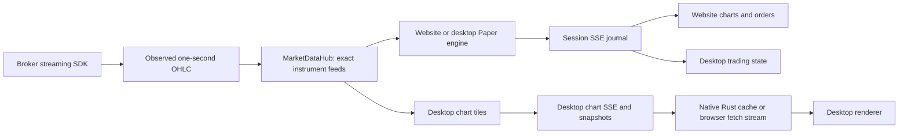

# Phase 19 — Shared live market data and partial take profit

## Agreed implementation scope

Implement shared live streaming for website and desktop; Half / Full for
TargetProfit and UnderlyingTargetProfit; smaller desktop open-order text;
AutoStop Limit entries in the website and desktop; website Day P&L units and
Kotak day-start capital/adjusted wallet recovery.
Desktop real trading is deferred. The original requests below are preserved.

## Sprints

1. Document architecture, decisions, acceptance and follow-ups.
2. Shared in-process MarketDataHub, exact-contract subscriptions and Kite lifecycle.
3. Desktop live/Paper integration and common provider fallback.
4. Website live integration, history handoff and SSE recovery.
5. Half / Full strategy sizing, exit allocation, APIs and both clients.
6. Typography, regression verification and Windows acceptance.
7. AutoStop Limit mode, ASL entry tickets, website checkbox and regressions.
8. Website Day P&L formatting and Kotak account/day capital recovery.

Implementation status and verification are recorded at the end of this document.

## AutoStop Limit implementation plan — implemented

- Extend AutoStop with `autostop_order_type` (`TARGET` / `LIMIT`), defaulting
  to TARGET for old requests and restored strategies. Persist the mode in metadata.
- At the existing bar-close event, compute the usual bar-high/low or percentage
  target and reflect it: `limit = 2 * close - target`. BUY limits lie below the
  close and SELL limits above it. Close 100 / BUY target 105 gives limit 95;
  close 100 / SELL target 95 gives limit 105. Use existing two-decimal rounding.
- Use the reflected price for sizing, stoploss validation and LIMIT placement.
  Retain guardrails, wallet/margin rules, exact options contracts, fill events,
  entry protection and completion after one successful placement. Invalid prices
  place no order and use existing logging/retry behavior on later bar closes.
- Both right-click entry tickets gain a separate **ASL** (Auto Stop Order Limit)
  choice beside existing order choices. This supersedes the original submenu
  request. AS stays TARGET; ASL uses LIMIT, with no entry-price picking step.
- Website AutoStop right panel gains an initially unchecked **Limit** checkbox,
  local to that panel. Right-click requests carry current trigger/deviation
  settings and selected direction. Desktop keeps its current trigger defaults.
- Verify both directions and calculation modes, sizing, invalid prices/stops,
  guardrails, cancellation, one-shot placement, request defaults/validation,
  persistence, desktop contract isolation and entry protection after fills.
  Check both clients with TypeScript, production builds and ticket regressions.

Implementation and validation results are recorded below. No data migration is
required. Manual desktop interaction and live broker acceptance remain external
checks; automated verification does not submit broker orders.

### AutoStop Limit validation

- Shared strategy and desktop backend regressions: **203 passed**, with the
  existing dateutil deprecation warning. Coverage includes ASL price reflection,
  sizing, defaults/validation, metadata reload, cancellation/guardrails, exact
  desktop options contracts and fallback entry stoploss after LIMIT fills.
- Website and desktop TypeScript checks and Vite production builds passed.
  Existing bundle-size warnings remain. Desktop ticket sizing and target-label
  regressions: **9 passed**.
- Tests used isolated DynamoDB Local configuration with one connection attempt
  to avoid unavailable local-service retries; no live broker orders were sent.
- Git metadata is read-only in this workspace. Changes remain uncommitted on
  `dev`; feature-branch creation and PR submission could not be completed here.
- Native desktop interaction, website click-through and real-broker acceptance
  still require manual validation.

### AutoStop Limit implementation details

**Shared API and persistence.** `StartStrategyRequest` accepts
`autostop_order_type: Literal["TARGET", "LIMIT"] = "TARGET"`. The website
request interface exposes the same optional field, and
`DesktopStartStrategyRequest` inherits it. Both start routes use the shared
strategy router, which stores the selected mode in strategy metadata. The
service falls back to TARGET when restored metadata omits the field. Unknown
request modes fail schema validation. The strategy type remains `AutoStop`;
ASL does not introduce a second strategy identity or database schema.

**Bar-close calculation.** The service first computes the existing target
from the completed bar: high for BUY or low for SELL in bar mode, and close
plus/minus the configured percentage in deviation mode. LIMIT reflects that
unrounded price around the same completed bar's close, then rounds the result
to two decimals. The first tick in the next bar triggers the calculation; its
price does not replace the completed bar's close. A zero target gap produces a
limit at the close. Nonfinite, nonpositive and rounded-to-zero entry prices
place no order. This change retains existing price precision rather than
introducing new exchange tick-size rounding.

**Sizing and order lifecycle.** Funds-ratio and risk-ratio calculations receive
the reflected entry price. When risk sizing needs a default stoploss, it also
uses that entry price. Explicit BUY stops must be below the resulting entry;
explicit SELL stops must be above it. LIMIT placement supplies `limit_price`,
while TARGET continues to supply `trigger_price`. Orders retain `is_autostop`,
entry stoploss/group metadata, contract identity and wallet/margin information,
so existing fill and protection handling applies to both modes. Successful
placement completes the strategy once; it does not wait for the entry to fill.
Guardrail blocks, invalid calculations and placement failures preserve the
existing RUNNING/retry behavior. Cancelling the running strategy prevents
future placement; after placement, cancel the pending order through the normal
order controls.

**Website controls.** The AutoStop panel has a local, initially unchecked Limit
checkbox, explanatory text and a Start AutoStop Limit label. Right-click entry
selection offers AS and ASL; both proceed to saved sizing without entry-price
picking. ASL has the full Auto Stop Order Limit tooltip/accessibility label.
Right-click requests now carry the selected direction and current AutoStop
trigger/deviation settings, making those settings consistent with the panel.
The clicked chart price remains the requested entry stoploss, not the limit
entry price. The existing server rule still forces options AutoStop to BUY.

**Desktop controls.** ASL appears beside M/L/T/AS in the entry ticket and uses
the same immediate submission path as AS once a size is selected. The start
request carries LIMIT mode, selected side, stoploss and sizing plus the option
tile's strike/expiry. The existing desktop strategy route binds it to the exact
registered contract. The start notice identifies Auto stop limit. Desktop
continues to use its existing bar trigger defaults; this feature adds no
strategy-settings UI or native Rust changes.

### AutoStop Limit lessons learned

- Model the entry order kind as a per-start option on the shared strategy.
  This keeps clients consistent and preserves cancellation, persistence and
  compatibility with existing AutoStop sessions.
- Transform the price before sizing and stoploss validation. Changing only the
  submitted order price would size against the wrong entry and could accept a
  stoploss on the wrong side of the actual trade.
- Treat chart-clicked stoploss and bar-derived entry as different inputs. A
  stoploss that is valid for the original target can be invalid for the reflected
  limit and must be checked again when the bar closes.
- Review every entry path when adding a strategy option. The website panel
  already forwarded direction and trigger settings, while the right-click
  path omitted them; AS/ASL now forwards those settings explicitly.
- Preserve AutoStop provenance on LIMIT orders. Entry protection depends on
  provenance and fill metadata, not just the TARGET order type. Regression
  tests exercise fallback stoploss creation after a LIMIT fill.
- Test completed-bar prices against different next-bar prices, and check
  attached option contract identity. These catch premature placement and
  accidental use of another chart's prices or contract.
- Separate implementation evidence from acceptance evidence. TypeScript,
  builds and backend tests do not establish native Windows interaction or
  successful live broker execution. Existing dependency/bundle warnings are
  recorded without claiming a full repository suite or broker acceptance.
- Use isolated test configuration when local DynamoDB is unavailable. The
  successful run restricted connection attempts; production database and
  retry behavior were not changed to accommodate the test environment.

### AutoStop Limit remaining acceptance and delivery

- Website: verify checkbox on/off and AS/ASL tickets, BUY/SELL equity and CE/PE
  options, each sizing mode, cancellation before bar close and the correct
  pending order/price after it. Confirm AS still places the original TARGET.
- Desktop: verify ASL with size-first and type-first ticket selections,
  exact option contracts, chart/order visibility and stoploss protection after
  fill in supported Paper, Replay and Stepwise flows.
- Confirm invalid reflected entries and stops place no order and leave the
  strategy available for cancellation or the existing next-bar retry.
- Verify website real-broker LIMIT submission and fill/protection behavior in
  the authorized broker acceptance environment. Desktop real trading remains
  outside this feature's scope.
- Automated results above are targeted regressions, not a full repository test
  run. No migration, deployment or merge to main was performed. The read-only
  Git constraint prevented feature-branch creation, commit and PR submission;
  PR title/body were provided separately for delivery through the normal
  reviewed workflow into `dev`.

## Website Day P&L units and Kotak capital — implemented

### Requirements and bug classification

- **Website display bug:** the top Day P&L and previous-session contribution
  ignored the P&L display setting. Both must show percentage of session capital
  in percent mode, and amounts in currency mode.
- **Kotak capital bug:** Start/restart/resume assigned current `limits().Net`
  directly to session capital. Today's realized trading results and funds
  committed to positions/orders could therefore change the sizing/P&L baseline
  when returning to the same account later that day.
- **Requested wallet behavior:** display a wallet excluding today's gross
  realized P&L while retaining broker deductions for committed funds. Include
  the whole account, external trades, other symbols, overnight positions and
  pending broker reservations. Open long options use entry cost, not LTP.
- Per the requirement, Kotak applies brokerage/fees after trading hours. Do not
  subtract estimated commissions in capital recovery. Paper accounting and
  desktop/Zerodha behavior remain unchanged.

### Plan and implemented accounting

The shared `real_accounting` service fetches the full Kotak limits report,
account identity, today's executions and positions. It uses the account-wide
reports rather than the selected chart's scoped trade history. Gross realized
P&L uses chronological weighted-average cost matching, deduplicates executions
by exchange/order/execution identity, and handles partial exits and reversals.
Carry positions seed inventory from `cfBuyQty`/`cfSellQty` and the corresponding
carry amount. Execution normalization retains the quoted-price multiplier and
conversion factors; quantities remain in shares/contracts rather than being
multiplied by lot size again. Unrealized price changes are not realized cash.

| Value | Calculation / purpose |
| --- | --- |
| Raw available funds | Kotak `Net`; retained for affordability and local reservation accounting |
| Gross realized day P&L | Account-wide matched execution profit/loss, before estimated fees |
| Committed funds | Broker `MarginUsed`, covering position and pending-order deductions |
| Recovered day-start capital | `Net - gross realized P&L + MarginUsed` |
| Adjusted website wallet | `Net - gross realized P&L` |

Example: opening capital ₹18,000, realized profit ₹1,200, no committed funds:
Net is ₹19,200, recovered capital and adjusted wallet are ₹18,000. With ₹5,000
committed, Net is ₹14,200, adjusted wallet is ₹13,000, and capital remains
₹18,000. After a ₹1,200 loss with no commitment, raw Net is ₹16,800 while the
P&L-excluded wallet is ₹18,000. Raw Net still limits affordability; adjusted
wallet is a display value and never grants additional buying power.

`MarginUsed` is treated as the aggregate commitment, including long-option
premium and pending reservations. Do not separately add option cost, premium,
full equity notional or a locally estimated margin on top of that field.
This accounting relationship is an explicit broker acceptance assumption;
Kotak documents the fields but not a complete balance identity. See the
[Kotak limits reference](https://github.com/Kotak-Neo/Kotak-neo-api-v2/blob/main/docs/Limits.md).

### Persistence, API and refresh integration

- Atomically initialize `day_start_capital` with DynamoDB `if_not_exists` in an
  existing WalletLedgers item keyed by user and `real-capital:<account>:<date>`.
  The first valid recovery is reused across same-day sessions and processes;
  another account/date has its own baseline. No table migration is required.
- The canonical `real:<date>` ledger stores raw broker cash plus account ID,
  recovered capital, adjusted display, gross realized P&L and committed funds.
  Snapshot persistence precedes updating the local raw-cash mirror.
- `WalletResponse` adds optional `display_balance`; `balance` keeps its raw
  meaning. Broker snapshots add optional `session_capital` and
  `wallet_display_balance`; their `wallet_balance` remains raw.
- New sessions and saved resumes receive corrected capital before guardrail
  initialization. Active Start reuses the baseline. Wallet reads can correct
  legacy session capital from the saved snapshot without contacting Kotak.
- Explicit wallet/chart refresh and trade-history reconciliation call the same
  accounting service. Reconciliation reuses its account-wide executions and
  positions; limits are fetched once. There is no periodic or per-tick polling.
- Corrected capital is persisted to real sessions for the same user/date.
  Website wallet callbacks and broker snapshots update only the matching active
  real session; stale responses cannot replace another session's denominator.
- Nonfinite/missing limits, unavailable carry cost, conflicting executions or
  inconsistent reported quantities fail accounting without replacing the last
  valid wallet snapshot. Broker/input errors return 502 on start/explicit
  refresh; persistence errors return 503. Reconciliation preserves its valid
  trade revision and reports a separate wallet error if funds accounting fails.

### Website display implementation

A tested formatter converts top Day P&L and the previous-session contribution
using corrected session capital, preserving signs, two decimals and existing
colors. Zero, negative or unavailable capital falls back to amounts rather than
producing invalid percentages. The existing P&L numerator and estimated
commission deductions are unchanged. The wallet widget prefers optional
`display_balance`, then its existing capital/raw balance fallbacks, so Paper
and legacy response shapes remain compatible. Paper currently includes realized
trading results in its wallet; this requested Kotak presentation intentionally
excludes those results.

### Lessons learned

- Available cash, P&L-excluded wallet display and day-start capital serve
  different purposes. Giving them separate fields avoids changing order
  affordability when improving the UI.
- Broker Net is account-wide. Removing only one chart's P&L would yield a
  capital baseline that changes when trading another underlying externally.
- Read committed funds from the broker aggregate; adding option premium or
  estimated equity margin again would recover the same money twice.
- Carry exits require an entry-cost seed. Today's sell proceeds alone are not
  realized profit, and unrealized movement must not enter cash recovery.
- Preserve instrument conversion factors through normalization and deduplicate
  executions before matching. Otherwise raw reports can produce incorrect
  realized P&L even when their displayed trade list appears reasonable.
- Persist the baseline once per account/day and propagate it into both server
  sessions and website state. Correcting the database alone leaves percentage
  labels and sizing denominators stale until a new session starts.
- Initialize corrected capital before guardrails. Replacing it only after
  session creation gives initialization code the wrong denominator.
- Reject incomplete financial inputs instead of silently falling back to Net
  or zero. Keep verified snapshots when broker reports or persistence fail.

### Validation and remaining acceptance

- **462 backend regressions passed** across real accounting, broker wallet and
  snapshots, wallet/session resume/simulation, orders, real trading/protection,
  strategies and desktop trading. The focused accounting/wallet/snapshot set
  contained **70 passing tests**, included in the broader result. A final
  focused run passed **72 tests** after adding browser-read capital correction
  and cross-user/date/Paper isolation coverage.
- **9 frontend tests passed** for P&L formatting, corrected-capital ownership,
  broker snapshot ownership and Paper resume behavior. Website TypeScript and
  Vite production build passed; the existing bundle-size warning remains.
- Backend verification used the project venv, isolated DynamoDB Local settings
  with one connection attempt, and a temporary bounded-selector test runner
  for sandbox wakeups. Production event-loop behavior was not modified.
  Existing dateutil and two simulation-test marker warnings remain.
- No full repository suite, live broker execution or native Windows acceptance
  is claimed. Manually verify Net/MarginUsed against a Kotak account with open
  options and pending orders, percent/currency toggling, chart/history refresh,
  browser reload and same-day restart. The assumption that MarginUsed includes
  premium/reservations requires that broker acceptance check.
- Intraday deposits/withdrawals, collateral revaluation and end-of-day fee
  adjustments are outside recovery acceptance. Independent broker endpoints
  are not an atomic financial snapshot; reported quantity mismatches request
  a retry, but a limits change during report collection remains a broker
  acceptance concern, particularly for the first baseline initialization.
- Git metadata remains read-only. Changes are uncommitted on `dev`; feature
  branch creation and PR submission are blocked in this workspace. No merge
  to main or deployment was performed.

### Dev pull / stash merge follow-up

The pull's stash application conflicted only in this document: upstream had no
content in the conflicted block, while the stash contained the AutoStop Limit
implementation/lessons and Kotak capital/P&L sections. Retain those sections and
remove the conflict markers. Settings review also found that loading the saved
P&L unit from the backend updated the modal and localStorage but not the active
website display; the same P&L callback now propagates that loaded setting to App.
ASL remains per-entry, the panel Limit checkbox remains local, and existing
sizing/strategy setting callbacks are retained.

Git index writes remain blocked by the workspace's read-only `.git` mount.
The document content is resolved, but Git's unmerged index entry must be marked
resolved with `git add docs/spec-phase19.md` in a writable Git environment.

## Streaming architecture review

Before Phase 19, website Paper/Real selected the admin provider, registered a
provider consumer, and read one-second OHLC from paper_tick_queue. The session
evaluated orders/strategies and published chart and trading events into a
replayable SSE buffer. KiteBroadcaster already shared one KiteTicker across
website sessions; its background thread delivered to asyncio session queues.

Desktop chart streams separately owned tiles, history and queues and hardcoded
Breeze. Native Rust consumed authenticated SSE; the renderer read a local cache
every second and checked backend health every 15 seconds. Browser chart preview
polled snapshots each second. Desktop Paper engines followed website provider
selection, so charts and engines could receive different providers. Phase 18's
prompt trading-event notifications, independent quote batching, event journal,
30-second reconciliation, engine fencing and window ownership must be preserved.

| Approach | Advantages | Costs / limitations | Decision |
| --- | --- | --- | --- |
| Extend KiteBroadcaster directly | Smallest change | Session/provider coupling remains | Migration bridge only |
| Shared service in backend | Shared identity, routing, quotes and lifecycle; low cost | Process-local, API/feed share failure domain | Selected |
| Dedicated feed process | Independent restart and connection ownership | Transport, supervision and recovery; session routing still needed | Future |
| Connection per user/client | Useful for distinct user credentials | Duplicate shared subscriptions, connection limits | Not for shared credentials |

Use one Kite streaming connection per configured credential set, not one per
user or client. Kite supports 3 sockets per API key and 3,000 instruments per
socket (https://kite.trade/docs/connect/v3/websocket/). Multiple sockets each
receive their own subscriptions; they do not partition website/desktop events.
Historical REST clients remain separate. The Python SDK shares a Twisted reactor;
closing a socket must not stop that process-wide reactor.

MarketDataHub owns subscriptions keyed by canonical exchange/kind/symbol or
underlying/expiry/strike/right. A subscription handle releases only its consumer.
Provider adapters own credentials, token resolution and connections. Existing
session and tile adapters preserve downstream event shapes. Trading engines keep
subscriptions independently of chart visibility. Users share quotes, never
wallets, positions or trading events.

Provider selection is captured when a feed group starts. Admin changes affect new
groups; Paper charts inherit their engine's group. Selected and actual providers,
connection state and quote age are visible. Fallback attempts each source once:

| Selected | Paper / desktop charts | Website Real |
| --- | --- | --- |
| Kite | Kite → Breeze | Kite |
| Kotak | Kotak → Kite → Breeze | Kotak → Kite |
| Breeze | Breeze → Kite | Breeze → Kite |
| Fyers | Fyers → Breeze → Kite | Fyers → Breeze → Kite |

The older claim that Real cannot use Breeze is incorrect: current Real supports
Breeze but does not fall back from failed Kite to Breeze. Real execution still
uses Kotak, existing access/authentication checks and broker-confirmed fills.
Transient disconnects reconnect; terminal authentication/retry failures advance
fallback. Keep a successful fallback until explicit restart.

Keep SSE downstream and REST commands. SSE does not distribute in-memory engines,
registries or replay buffers: deployment remains one API worker. Later extraction
needs feed transport plus session ownership and command/event routing, not merely
an extra worker. No Redis, SQS, Kafka or additional database is required now.

Preserve IST-as-UTC chart timestamps and aligned candle boundaries. Kite LTP mode
has no exchange timestamp, so receipt time is explicit. Finalize observed seconds
without waiting for another trade; do not invent empty candles. Order evaluation
remains one-second, rather than raw-tick. Subscribe before loading history; merge
buffered observations into the baseline, keeping minute gap-fill distinct from
real second observations. Refresh and reconnect history are never replayed as
new fills. Provider changes start a fresh aggregation generation.

Use bounded delivery with explicit overflow/gap recovery; preserve candle extrema
and committed trading events. Stream consumption continues during snapshot
recovery. Record connection/subscription counts, source changes, quote age,
overflow and replay gaps through existing logs.

## Half / Full semantics

Persist target_profit_size = full | half, defaulting missing values to full.
Both target variants support editing while armed, before the target condition
fires. Subsequent order changes use ordinary order editing.

Compute Half from the exact-contract current position when the condition fires:
options max(1, floor(current_lots / 2)) lots, equity max(1, floor(shares / 2)),
capped at the position. Lots 1/2/3/4/5 select 1/1/1/2/2. Flat creates no order.
A four-lot position manually reduced to two therefore selects one lot. Target
prices, percentage-of-capital calculations and trigger buffers are unchanged.

Allocate selected quantity from closing orders in creation order, splitting where
necessary and retaining original protection for the remainder. TargetProfit
converts/creates only the selected quantity as LIMIT; UnderlyingTargetProfit
shifts/creates only that quantity using its existing option-price buffer. Reconcile
remaining exits after fills/manual reductions. Real modifications are confirmed
before local updates; failed actions stay retryable without duplicating successes.

Website forms and both context menus expose Half / Full; armed strategies can
change size separately from price; labels show size. Desktop open-order summary
text becomes .625rem; ticket inputs and controls retain their sizes.

## Acceptance and deferred work

Automated coverage: shared connection and instrument subscription across users,
exact strikes/expiries, independent release, concurrent startup/reconnect,
credential replacement, quiet symbols, queue overflow, history handoff, SSE gaps,
source selection/fallback, half rounding/manual exits, remaining protection,
long/short contracts, failures and legacy Full compatibility.

Windows acceptance: rebuilt native app, live Kite, website plus desktop and two
users/screens, equity/NIFTY/CE/PE, refresh and interval switches, pop-out, reconnect,
provider failure, partial take profit with existing stops, Paper Stop/Resume and
wallet recovery. Do not label mocked broker tests as live acceptance.

### Authentication follow-up (same document, separate implementation)

Legacy website REST trusts X-User-Id; SSE now checks the supplied user identity
against session ownership, but that supplied identity is not verified authentication.
Desktop has verified bearer tokens but retains a trusted-header compatibility
path. Ownership comparisons alone do not verify identity.

Migrating now gives verified isolation immediately but broadens this phase into
login, REST and SSE compatibility work. A separate follow-up keeps the feed and
strategy changes independently reviewable, but the deployment limitation remains
until migration. The separate follow-up is selected.

Reuse the token lifecycle behind client-neutral endpoints, migrate website
password/Google login and REST/fetch-SSE to verified tokens, handle expiry,
refresh/logout/reconnect, and remove production trusted-header fallback. Explicit
development/test identities stay non-production. Test forged headers, cross-user
sessions, expiry and logout. No new roles or trading restrictions are needed.

## Implementation and verification status

All six sprints are implemented on `dev`; native Windows interactive and live
market acceptance are tracked separately from code completion.
The shared hub routes website and desktop subscriptions through existing provider
SDK adapters; no desktop real-trading workflow has been added. Exact-contract
quotes, history watermarks, generation checks, provider status and SSE reset
recovery are integrated. Both clients expose Half / Full and armed size edits.
Split orders retain the remaining protection, and tagged pending exits are capped
or cancelled after committed position reductions. Broker changes precede local
updates; paper execution also caps tagged orders against the remaining position.

Automated verification uses mocked provider connections and isolated DynamoDB
fixtures. Website and desktop production builds pass. The focused backend suite,
Paper wallet/recovery/EOD suite, desktop renderer suite and native Rust tests pass;
final counts and commands are recorded below. Native Rust checks ran on Linux,
which verifies the host code but is not a Windows installer or interactive test.
The drawing-persistence regression found during verification is fixed: validation
accepts numeric DynamoDB `Decimal` prices when updating a saved drawing.

A separate legacy API test run timed out on the first synchronous `TestClient`
request, waiting inside the AnyIO thread portal in this execution environment.
That limitation is not counted as a pass; the entire backend suite is not claimed
as passing. Existing direct router/service tests cover the affected flows, and
market-hours/manual acceptance remains outstanding.

Valid broker tokens are useful for the market-hours acceptance run; automated
checks do not depend on those tokens and do not place live orders.

### Sparse diagnostic logs

Normal ticks, quotes, timer flushes, candle updates and renderer polling do not
produce new INFO logs. Use backend logs to trace these lifecycle boundaries:

- `market_data_feed_opened` / `market_data_subscribed`: provider, canonical
  instrument, consumer and active upstream count. Duplicate consumer subscriptions
  share a feed; different instruments still have separate upstream registrations
  on the same SDK connection.
- `market_data_first_tick`: once per upstream lifetime; confirms the broker data
  reached the hub. It is expected to be absent when exchanges are closed.
- `market_data_feed_released`: emitted when the last consumer releases a feed.
- `market_data_subscribe_failed`, `market_data_handover`,
  `market_data_connection_restored`: startup failure, fallback generation and
  socket recovery. Kite/Fyers socket health is checked separately from quote
  activity, so reconnecting at night does not require a fresh tick.
- `market_data_overflow`: first queue loss and at most once per minute per
  consumer thereafter. Replay gaps are logged when an SSE reset is required.
- `take_profit_half_allocated`, `take_profit_half_completed`,
  `take_profit_half_deferred`, `take_profit_exit_reconciled`: chosen lot quantity,
  committed actions, retryable failures and changes to remaining exits. Repeated
  half-action failures are logged at most once per minute per strategy.

At night, validate builds, mocked delivery, startup/cleanup and socket status.
Do not use quote silence as proof of a streaming defect. During market hours,
open the same contract in website and desktop, check one feed-open log with
multiple consumers, one first-tick log, and matching chart prices. Closing one
client must leave the other consumer receiving data; closing the last consumer
must produce the feed-release log. Compare chart history after reconnect and
exercise Half against four lots, then a manually reduced position, in Paper.

## Delivered implementation details

### Components and ownership

| Component | Responsibility |
| --- | --- |
| `services/market_data.py::MarketDataHub` | Normalize exact instruments; deduplicate provider registrations; distribute observations; cache quotes; manage feed-group fallback |
| `FeedGroup` | Capture selected/actual provider, connection state and generation for an engine and its attached charts |
| `Subscription` | Release one consumer independently; closing a window cannot release another user's feed |
| `ProviderAdapter` | Resolve provider-specific tokens/symbols and register with existing Kite, Fyers, Kotak or Breeze SDK adapters |
| `SessionFeed` | Own underlying and base CE/PE engine subscriptions; replace a chart strike without interrupting unrelated subscriptions |
| `desktop_live_service` | Own chart tiles, history, observation caches, chart SSE and snapshot recovery |
| `simulation` | Apply history/live watermarks; evaluate orders and strategies; publish session trading events |
| `strategy_service` / `order_service` | Allocate Half; preserve remaining protection; persist sizing; reconcile tagged exits after position changes |



SDK callbacks cross into the asyncio loop using the existing thread-safe
broadcaster bridge. Historical REST work runs off the event loop. The hub owns a
provider/instrument registration, while SDK broadcasters own the shared socket;
one registration per instrument does not mean one socket per instrument.

Desktop browser preview now consumes authenticated fetch SSE rather than
requesting snapshots every second. Native desktop retains Rust SSE consumption,
local cache reads and prompt trading notifications from Phase 18. Periodic
snapshots reconcile history and state independently of quote delivery. Website
EventSource retains cursor replay, and an expired cursor requests reconciliation
through `stream_reset`.

### Recovery and lifecycle behavior

Subscriptions begin before history loads. Historical observations populate
charts and exact-contract watermarks; they do not run Paper/Real fills. Live
observations at or behind a contract's watermark are discarded. Provider and
feed-generation checks run before advancing live watermarks, so obsolete queued
observations cannot suppress the replacement provider's valid data.

Fallback prepares replacement registrations before moving consumers. Failed or
cancelled preparation releases replacements. A consumer closed during preparation
stays closed. Releasing a group's last consumer cancels its pending recovery.
Each SDK delivery bridge belongs to one upstream registration: callbacks from a
released socket/registration cannot write into a newly opened feed with the same
instrument key.

Connection recovery, fallback and exhaustion publish `feed_status` even without
a quote. Desktop ignores older status cursors. Kite's elapsed-second timer emits
an observed candle once and keeps a finalized watermark so late packets cannot
emit it again. No timer creates artificial candles when a market is closed.

Queue overflow reports an explicit gap and prompts snapshot reconciliation.
Dropped observations are not replayed as hypothetical fills. A successful
fallback remains selected for that group's lifetime; an admin source change
applies to new groups. The deployment still uses one API worker.

### Strategy API, persistence and client behavior

`POST /api/strategies/start` accepts `target_profit_size: "full" | "half"`.
Omitted fields and old saved strategies default to Full. The desktop start route
uses the same strategy implementation. Size edits use:

- Website: `PATCH /api/strategies/{strategy_id}/size`.
- Desktop: `PATCH /api/desktop/v1/trading/{session_id}/strategies/{strategy_id}/size`.
- Body: `{ "session_id": "…", "target_profit_size": "half" }`.

An armed strategy can change size before its condition fires. Once it has applied
an action, its generated orders use ordinary order editing; changing size does
not re-run a completed strategy. Both TargetProfit and UnderlyingTargetProfit
have Half/Full context menus, form controls, editable armed sizing and size labels.

Half reads the current exact-contract position at the condition, rounds down to
whole option lots and selects at least one lot when a non-flat position exists.
An oversized old closing order is trimmed to the current position before the
selected quantity is split. Existing closing orders are allocated in creation
order. The remainder keeps its original trigger/limit price. Successful action
IDs are retained for retry, and completion is persisted only after actions
succeed. Half-action and size-edit persistence errors propagate rather than
silently reporting success. Broker modifications are acknowledged before local
quantity/type changes.

Orders persist `exit_allocation_id` and `exit_position_side`. After a committed
trade, pending allocated exits shrink or cancel to match the remaining position;
Paper execution also caps their quantity before filling. `order_updated` events
carry changed orders to both clients. The desktop reducer merges an existing
order instead of duplicating it or ignoring its new quantity. `strategy_updated`
refreshes armed strategy state. These additions do not enable desktop real trading.

### Lessons learned

1. Share market-data ownership at the instrument boundary, while keeping trading
   state and downstream journals scoped to each session/user. Sharing the SDK
   socket alone did not align desktop charts with their engines.
2. A healthy connection and fresh quotes answer different questions. Night-time
   quote silence must not trigger fallback by itself; status changes also need a
   delivery path independent of incoming quotes.
3. Subscribe before loading history, then use exact-contract watermarks. A
   historical baseline must not execute restored orders, and stale generations
   must be rejected before they update those watermarks.
4. Cancellation is part of subscription ownership. An SDK startup thread can
   finish after cancellation, and a fallback can finish after a window closes;
   both need explicit cleanup. Registration-specific delivery identity prevents
   late callbacks reaching a new owner.
5. Partial exits require both allocation and reconciliation. Half rounding alone
   is insufficient when an old stop still covers the larger position or the user
   reduces the position after allocation.
6. Local persistence and broker acknowledgement are separate success boundaries.
   Retain successful action IDs for in-process retries, propagate failed writes,
   and do not change local protection after a rejected broker resize. This does
   not claim distributed exactly-once execution across a broker/process crash.
7. Incremental UI events must support mutations to existing orders. Testing only
   placement and fills misses the visible quantity changes caused by splitting.
8. Keep diagnostics at ownership/state transitions. First observation, fallback,
   release and throttled gaps give useful evidence without one log per tick.
9. Mocked streaming and Rust unit tests can verify architecture while exchanges
   are closed; they cannot establish live broker behavior or Windows interaction.
   DynamoDB fixtures that already use Moto must run without a nested shared Moto
   context, otherwise independent tests can accidentally share wallet records.

### Verification and remaining acceptance

Final verification on 2026-10-01:

| Check | Result |
| --- | --- |
| Focused backend regression suite | 377 passed |
| Paper wallet / recovery / EOD suite with independent fixtures | 21 passed |
| Phase 19 tests (included in the focused suite) | 45 passed |
| Desktop renderer suite | 105 passed across 19 files |
| Native Rust host tests on Linux | 16 passed |
| Website TypeScript and Vite production build | Passed |
| Desktop TypeScript and Vite production build | Passed |
| Python compilation and `git diff --check` | Passed |
| Full legacy API suite via synchronous TestClient | Environment timeout; not claimed passing |
| Windows interactive and live broker acceptance | Pending external acceptance |

The automated checks cover shared users/tiles, exact option identity, independent
release, initial fallback, group handover, stale SDK callbacks, close-during-
handover cleanup, recovery cancellation, quiet-second finalization, night-time
socket recovery, history without broker orders, Half lot rounding, long/short
splits, manual reductions, preserved stop prices, broker failure and persistence
retry. Existing simulation, order, strategy, wallet and recovery tests remain in
the regression run. Desktop tests cover order mutations and stale status cursors.

Commands used from the project directories:

```bash
# Website
cd frontend
node node_modules/typescript/bin/tsc --noEmit
node node_modules/vite/bin/vite.js build

# Desktop renderer
cd windowsapp
npm run build
npm test

# Native host (Linux environment, cached dependencies)
cargo test --offline --manifest-path windowsapp/src-tauri/Cargo.toml

# Backend suites that own their DynamoDB fixtures
cd backend
/home/pratt/venvs/tradematangi/bin/python -m pytest \
  tests/test_phase18_paper_wallet.py tests/test_desktop_paper_recovery.py \
  tests/test_desktop_paper_eod.py -q
```

The focused backend run wraps tests without their own Moto fixtures in
`mock_aws()` and sets `app.services.db.USE_DYNAMODB_LOCAL = False`, avoiding
contact with local/live DynamoDB. It includes Phase 19, trading, strategies,
simulation, Phase 4 order updates, Paper option contracts, orders, desktop
trading/replay events/persistence/live refresh and Kite tests. Builds report
existing bundle-size warnings; compilation succeeds.

Interactive acceptance still requires the Windows app and live market data:
website plus desktop on the same contract, two user sessions, refresh/interval
changes/pop-out, reconnect/fallback, and Paper Half with existing stops and manual
reductions. No real orders were placed during implementation. Authentication
migration and distributed feed/session ownership remain the explicitly deferred
follow-ups above; neither is required to deploy the current single-worker design.

## Review follow-up implementation — 2026-10-01

The unstaged-change review found eight gaps in failure recovery and concurrency.
The three follow-up sprints below are implemented on `dev`. They retain the
process-local hub and existing order/strategy persistence boundaries; desktop
real trading remains outside Phase 19.

### Sprint A — Partial-exit recovery and independent reconciliation

Before changing protection, Half persists its selected quantity and a prepared
chunk in strategy metadata. `half_selected_quantity` freezes the first allocation
and is capped by a later reduced position. Adding to a position during retry does
not increase that allocation. Each prepared chunk records its action ID, selected
quantity, and (for a split) the remainder ID and original quantity. Stable action
IDs derive from the strategy and original order, with a separate ID for an
unprotected portion. The internal order service accepts these IDs; existing
public order request models are unchanged.

Orders carry allocation ID, original position side, and an optional `action` or
`remainder` role. New actions receive these fields in their first strict write.
Older records remain readable because these fields are optional. Strategy
progress records committed action IDs. On retry, the prepared record and existing
order are reconciled before another allocation is attempted. A failed prepare
write makes no order changes. A failed resize/action write cancels an
uncommitted action and persists its cancellation before restoring the original
protection. An action with an acknowledged broker ID remains tracked rather
than being treated as a rolled-back local operation.

After a committed position change, reconciliation caps aggregate tagged exits
for the exact symbol/right/strike/expiry and position side. Broker acknowledgement
precedes local resize or cancellation. A storage failure after an acknowledged
cancellation is repaired even though the order has left the pending list.
Failures enter a contract-scoped retry queue. The application lifespan owns its
worker: first retry after 5 seconds, then 10, 20, and 30 seconds, capped at 30.
The worker does not need another trade or market tick. Contract-scoped locks
serialize trade-triggered and worker reconciliation, and an older worker result
cannot clear a newer failed reconciliation request. Paper order restoration
reconstructs reconciliation work from persisted allocation tags and current
positions. The retry schedule is transient; persisted orders are its restart
source. Repeated failure logs are limited to once per minute per contract.

This is recoverable local intent, not an atomic transaction with the broker.
An ambiguous network timeout around broker order placement still needs the
broker's order reconciliation behavior; stable local IDs alone cannot prove
exactly-once broker execution. No real broker orders were sent in verification.

### Sprint B — Provider and tile lifecycle

An engine's initial underlying/option subscriptions now form one candidate
bundle. A provider is committed only when the complete bundle opens. Failure
releases that candidate's handles and tries the next permitted provider. Private
candidate queues prevent a failed provider's early ticks from entering the
engine. Rebind candidates use the same isolation until handover commits.
Existing consumers retain their shared feed ownership and independent handles.

Opening another tile on a group that is reconnecting no longer changes the
group to connected. Recovery comes from socket health or a provider observation.
A quiet exchange therefore remains distinct from a disconnected socket.

Chart history survives a provider change for display, but `option_quote` reads
only the current subscription's hub quote. Handover/disconnection establishes a
quote provenance boundary, so an earlier quote cannot authorize a chart-originated
Paper market order. There is no arbitrary quote-age timeout; a new observation
from the current feed restores eligibility.

Tile startup now checks tile object identity, history generation, and stream
lifecycle after the awaited subscription. A removed or replaced tile closes its
late handle instead of committing it. A per-tile activation lock also prevents
concurrent refresh/startup calls from creating duplicate handles.

### Sprint C — SSE and desktop snapshot reconciliation

Website SSE captures the replay-reset cursor once and reuses it after yielding.
An event arriving while the generator is suspended is therefore delivered after
the reset rather than skipped.

The desktop renderer uses one bounded live event journal for browser SSE and
native event batches. HTTP snapshot recovery keeps the returned historical
baseline and replays newer candle/status observations received in flight. It
also preserves newer observations already represented in renderer state if a
bounded journal has evicted older events. Matching uses stream identity and
contract identity for retained tile observations. Delayed responses/events from
an old stream cannot replace the active stream. Explicit stream starts and
restoration can replace it. Browser reconnect recovery, periodic health checks,
manual refresh, and native health checks share this reconciliation path.

Regression coverage includes failed remainder and action persistence, persisted
prepare recovery, frozen quantities after position growth, independent timed
retries, acknowledged-cancellation write repair, option-only startup failure,
failed-candidate tick isolation, reconnect status preservation, tile removal
during startup, current-provider quote eligibility, the SSE reset-yield race,
and snapshot requests with intervening events/native batches.

### Lessons from the review

- A broker resize, local order write, and strategy progress write are separate
  failure points. Save intent before mutation and recover from both order and
  strategy records; an in-memory list of action IDs is insufficient.
- Rollback ordering matters: restoring a full stop while a new action remains
  pending can over-protect a position. Confirm the uncommitted action is removed
  before restoring quantity. Known broker actions need reconciliation instead.
- Retry responsibilities belong to lifecycle workers. Market ticks are not a
  reliable retry clock, especially after market close or a manually flattened
  position.
- Subscription startup succeeds as a bundle for engines. Candidate observations
  must stay isolated until that provider is selected.
- A subscription registration is not evidence that a disconnected socket has
  recovered. Display history is also not execution quote provenance.
- Check resource ownership after every awaited acquisition. Removal during
  startup is a normal lifecycle race, and concurrent startup needs serialization.
- A newer event cursor and an authoritative history baseline contain different
  information. Keeping only one loses either history or recent observations;
  reconcile both, including browser polling and native recovery paths.

Automated acceptance remains exchange-independent. Windows interaction and live
market/broker behavior still require the external acceptance checks above.

## Website P&L indicator rendering follow-up — 2026-10-01

The website's P&L level calculator and pane position/capital wiring were reviewed.
The previous renderer used React DOM overlays with geometry calculated from
chart coordinates in effects. It removed every level if the aligned fill time
was absent from the chart time scale. Its updates also depended on React inputs,
time-range notifications, and selected DOM events rather than the chart's price
scale repaint. These paths can miss asynchronous history loads and price-scale
changes when the trade anchor is already known.

Lightweight Charts 4.2 supports this drawing through its native series primitives
API. `PositionPnlPrimitive` now attaches to the candlestick series and draws the
existing five-bar segments and labels directly on the chart canvas. Coordinates
are calculated during drawing, after chart autoscaling; no extra price-scale
events or DOM overlay state are needed. If a fill timestamp is missing, the
nearest available candle anchors the segment until its actual candle arrives.
No-trade fallback anchors remain stable while new candles arrive. The renderer
uses the chart pane's actual media bounds rather than the container dimensions,
so lines do not extend into the price/time axes. It detaches during chart cleanup.

The financial calculation, target percentages, indicator toggle, and exact
position filtering are unchanged. An open position with valid session capital is
required. Off-screen price levels remain off-screen; the indicator does not
stretch autoscale to include distant percentage targets.

Eight regression tests exercise exact-price segments/labels, absent fill times,
deferred history loads, price-scale redraws without a changed time range, stable
fallback anchors, pane clipping, disable/detach cleanup, and repaint requests.
They run alongside the existing financial-level tests in the renderer test
harness. Verification: 113 renderer tests pass, website and desktop TypeScript
checks and production builds pass, and `git diff --check` passes. Canvas tests
use controlled chart transforms; interactive browser acceptance is still needed
to confirm the reported screen/session visually.

Lesson: chart-bound drawings should use the library's render lifecycle. React
state changes alone do not describe every time/price transform change, and a
missing chart timestamp should not erase otherwise valid price levels.

## Website live-session regression repair — 2026-10-01

### Incident and root cause

Both an existing website Paper session and a fresh account returned repeated
`sse_session_missing` messages while historical chart requests continued to
succeed. The fresh account also reported `Get open option contracts failed: 404`.
That endpoint requires an in-memory session; an empty position list would return
success. These symptoms are consistent with the engine disappearing after Start.
Historical parquet requests run independently and do not prove that live streaming
is connected.

The reproducible failure was introduced by the shared-streaming change
(`48da1ce`): `SessionFeed.start()` read `paper_tick_queue.maxsize`, but the actual
`SimulationSession` uses `RingQueue`, which lacked that public property. The
resulting `AttributeError` occurred before opening a broker subscription. Paper
error cleanup then removed the session from memory, causing SSE and position
requests to return 404. Handover had the same assumption for `_ContractTickQueue`.
The later website P&L renderer change (`22c46bd`) did not cause this queue failure.
Website real trading uses the same feed startup and queue, so the queue repair
also covers its chart streaming.

### Completed implementation

1. **Queue/startup/handover:** `RingQueue` and the supplemental contract queue now
   expose `maxsize` and `full()`. Staged startup and provider-handover events use
   the same enqueue helper as normal delivery. Ring buffers retain their existing
   bounded, oldest-drop behavior; asyncio queues retain explicit overflow/gap
   reporting. Broker fallback keeps exact instrument metadata and trading state.
2. **Website Paper recovery:** unexpected engine termination releases runtime
   resources and ownership while preserving durable pending orders, wallet
   reservations, and running strategy intent. Explicit Stop keeps its existing
   cancellation/refund behavior. Resume restores running strategies, including
   progress metadata, with pagination and owner filtering. Failed restoration
   cleans up the rebuilt runtime without cancelling durable trading intent.
3. **Resume selections:** after restoring trades/orders, each side with an open
   option position selects its actual strike. A flat side keeps the newly requested
   strike. When several contracts are open on a side, the newest opening determines
   its primary selection; other open contracts and exact pending-order contracts
   remain tracked through supplemental subscriptions. Saved chart panes follow
   these resolved selections. Removed panes stay removed unless needed for an open
   position. Trades and orders retain their original strike, expiry, quantity,
   reservation, and identity; display selections do not rewrite them. Old primary
   CE/PE prices are cleared before live execution resumes. The existing single
   primary-expiry model remains in place.
4. **SSE lifecycle:** single-session and group hooks share a connection controller.
   After a connection error, it probes the existing active-session endpoint. A
   confirmed 404/410 ends retries, marks the member ended, retains its details,
   and asks the user to start again. Transport errors and server failures continue
   bounded retries. Cursor replay, reconnect reconciliation, and visibility
   recovery remain supported. Revision fencing prevents late probes or timers
   from reviving a closed/replaced connection. A normal `session_ended` event also
   terminates the connection.
5. **Diagnostics:** existing missing-session debug logs distinguish
   `not_in_memory` from `ownership_mismatch`; the stop log records whether trading
   state is preserved. A single resume-selection INFO event records resolved
   strikes and tracked-contract counts. Startup exception traces, feed connection
   events, and throttled overflow reporting remain available. No per-tick logging
   was added.

The Paper-specific restoration rules do not change real broker order execution
or desktop resume policy. Shared queue fixes also benefit desktop feed handover.
No desktop real-trading functionality was added.

### Verification and operational follow-up

- 426 backend tests passed across shared feeds, actual session startup queues,
  simulation/resume, trading/orders/strategies, and desktop integration modules.
- 21 additional Paper wallet and desktop recovery/end-of-day tests passed with
  their own mocked database lifecycle.
- 122 renderer tests passed, including nine new website SSE lifecycle cases.
  The website pane-resume test file also passed.
- Website production build and website/desktop TypeScript checks passed.
- Startup tests exercise concrete `SimulationSession` queues with Breeze/Kite,
  fresh/resumed Paper and real modes, fallback, handover, full buffers, live task
  delivery, and the actual SSE response. Broker adapters and execution callbacks
  are mocked; no real order or external broker request is issued. Mocked historical
  fetches run inline in the test fixture to avoid this sandbox's executor-shutdown
  hang; production thread behavior is unchanged.

Deploy/restart the backend and publish the website bundle together, then start
Paper again to rebuild an unavailable session. During market hours, confirm feed
connection/subscription success, live-phase entry, and incoming chart updates.
When markets are closed, a connected broker may legitimately supply no ticks.
Previously cancelled orders/strategies are not automatically resurrected: the
preservation change applies to future unexpected failures. Inspect existing order
status before deciding whether to replace an order cancelled by the old cleanup.
Live broker acceptance and deployment remain outstanding; these automated checks
verify the application paths with controlled broker delivery.

### Lessons learned

Tests that substituted `asyncio.Queue` for every engine queue missed the production
queue contract. Integration coverage now includes the real queue and session task,
as well as supplemental queue wrappers. A successful Start response or history
request is insufficient evidence that a background live engine survived startup.
Transport retry policy needs an authoritative session-state probe, and unexpected
engine failure needs a different durable-state policy from a user-requested Stop.
Chart selection and persisted trading intent should be resolved independently so
flat sides can adopt a new selection without rewriting existing orders.

## Website real-trading permission refresh — 2026-10-01

Google and password login both resolve a stored Users record. Real-trading
whitelist checks use its normalized email, independent of login method; Google
login to an existing email reuses the same user ID. Tests confirm Admin grant,
access dependency checks, and revocation for password login, a fresh Google
account, and Google login to an existing password account.

The website previously checked permission only on mount. An Admin grant after
that check left the already-open page showing no REAL option. Failed HTTP checks
were converted to `has_access: false` and silently swallowed, so temporary server
failures could also hide the option for the rest of the page lifetime. This is a
confirmed code defect; the affected deployed account's exact cause has not been
confirmed from production records.

Implemented refresh on identity change, window focus, and visible-tab activation,
with duplicate in-flight checks suppressed and cleanup preventing old responses
from updating a replaced account. HTTP failures now raise `ApiError` and retry
after five seconds; one console warning is emitted per failure episode. A
successful false response remains a genuine denied-access result. Backend
whitelist lookups use consistent reads so recent grants/revocations are visible
immediately. The access endpoint emits a DEBUG decision with user ID, access
result, and reason (`admin`, `whitelisted`, `user_missing`, `not_whitelisted`).
There is no per-tick permission check or log.

Verification: three mocked-DynamoDB identity/grant/revocation integration cases,
nine existing whitelist-service tests, and three website API tests passed;
website TypeScript and production build passed. The identity integration tests
call the actual route functions and access dependency with mocked Google token
verification and durable database writes; they do not call broker APIs.

Operationally, the REAL toggle requires today's IST date and an exact matching
email entry in Admin. After deployment, returning to the affected tab refreshes
permission. If access remains denied, the debug decision and stored email/whitelist
entry distinguish missing identity from an unmatched entry. Entries are currently
added one email at a time. No authentication provider or broker order execution
behavior was changed.

## Desktop Windows build dependency isolation — 2026-10-01

The Windows packaging workflow installs dependencies only in `windowsapp`, then
Tauri runs `npm run build`. The desktop TypeScript configuration included every
file under `src`, including `websitePositionPnlPrimitive.test.ts`. That test
imports the website primitive, whose type imports require the website's
`lightweight-charts` installation. CI therefore failed with TS2307 and cascading
implicit-any/unknown-type errors. Local builds with both applications' dependencies
installed hid this problem.

The production desktop TypeScript configuration now excludes `*.test.ts` and
`*.test.tsx`. Runtime desktop code still receives strict type checking; Vitest
continues discovering the tests independently. The desktop application acquires
no website chart dependency. Verification includes a successful production build
in an isolated temporary desktop checkout with only desktop node_modules and no
sibling website checkout. The complete renderer suite also runs separately. The
native Windows installer itself is verified by the Windows CI workflow.

Lesson: cross-application regression tests must not expand a production package's
compile graph into sibling applications. Verify dependency isolation as well as a
build in a developer workspace containing all installed packages.

## SENSEX contamination of option live feeds — 2026-10-01

### Reproduction and cause

Website Paper charts displayed correct history after reload, then alternated
between genuine option premiums (for example PE at ₹30–₹50) and SENSEX values
near ₹71,000. A regression using the real Breeze manager, multiplexer callback,
provider adapter, hub, and concrete session queues reproduced the failure in
Paper and real feed configurations. One underlying candle generated four
observations for a session tracking the index, CE, PE, and a supplemental option.
The existing twelve Breeze callback tests passed while these two new isolation
cases failed.

The Breeze callback intentionally fans out raw ticks to all managers. The cash
filter previously ran only when a manager contained cash subscriptions. An
option-only manager therefore accepted an index tick, aggregated it under a
cash route, and forwarded it to its option feed. The hub then attached that
subscription's CE/PE, strike, and expiry, disguising an index price as a correctly
identified option candle. The website routed it by that right. Its candle
aggregator retained the maximum high, so a later correct premium could not remove
the corrupt high. Reloading the chart corrected its historical baseline briefly
but did not repair live routing.

The same observation reached backend quote storage and order/strategy evaluation.
This establishes a potential execution impact; no production fills were inspected
or established as affected during this repair.

### Implementation

- Breeze now requires every non-option observation to match a cash/index
  subscription owned by that manager. Option-only and empty managers discard cash
  observations before candle aggregation, accepted-tick accounting, or delivery.
  Mixed managers continue routing both asset types. Exact option ScripCode
  ownership and contradictory-right rejection remain in place, including BFO
  payloads that omit right/strike.
- The hub validates adapter candle identity before quote updates, first-tick
  logging, connection-state changes, metadata attachment, and delivery. Option
  candles require the expected CE/PE right; supplied strike/expiry must match.
  Underlying feeds reject candles carrying an option right. This covers normal
  delivery and events buffered during startup/handover. Control messages retain
  their existing behavior. All supported adapters already label option candles;
  regression mocks now provide that same identity.
- Unexpected hub identity rejection logs `market_data_identity_rejected` with
  provider, instrument, reason, raw identity, and cumulative rejected count. The
  first rejection logs immediately, followed by at most one warning per feed per
  minute. Normal filtering of other managers' raw callbacks adds no per-tick log.
- No price limits, HTTP/SSE schema changes, chart workarounds, separate broker
  connections, or changes to durable trades/orders were introduced.

### Verification and recovery

489 backend regression tests passed across Breeze, shared feeds, actual Paper and
real startup tasks, simulation/resume, order/strategy processing, and desktop
integration. The website production build and isolated desktop production build
also passed, with the existing bundle-size warnings.

New coverage includes raw interleaved SENSEX/CE/PE callbacks, a PE premium of ₹40,
shared feeds across two users, supplemental contracts, cash-only/option-only/mixed/
empty managers, unknown ScripCodes and contradictory rights, adapter identity
rejection for all four providers, throttled diagnostics, and staged startup and
handover. Full session-loop tests verify fifteen correctly routed SSE candles,
correct cached primary premiums, and the prices seen by order/strategy callbacks.
Broker SDK access, security-master resolution, historical fetches, and execution
callbacks are mocked; tests issue no external broker request or actual order.
Valid high-priced options remain accepted, proving there is no price heuristic.

After backend deployment/restart, restart affected live sessions to discard old
accumulators, quotes, queued observations, and replay buffers; reload charts from
historical data. A market-hours check must confirm that no index-valued candles
reappear in options, including after repeated reloads. Durable trades, pending
orders, reservations, and strategy intent retain their existing recovery policy.
Previously affected fills are not automatically reversed or rewritten; inspecting
production records is a separate read-only investigation. Deployment and native
Windows installer verification were not performed here.

### Lessons

An adapter's subscription identity must not substitute for validating the incoming
observation: attaching correct contract labels can conceal an incorrectly routed
price. A shared SDK callback requires ownership checks for cash ticks as well as
options. Tests must drive actual raw callback fan-out through the adapter/hub,
include mixed asset types, and interleave ticks while candles accumulate. Chart
reload and backend cache fixes cannot compensate for incorrect feed routing.

## Kotak weekly option month encoding — 2026-10-01

The user confirmed the live Kotak symbol for SENSEX, expiry 2026-10-01,
strike 71200 PE as `SENSEX26O0171200PE`. The formatter previously encoded
October numerically as `10`, generating `SENSEX26100171200PE` and causing
invalid-symbol errors. Its existing October/December unit tests also asserted
that incorrect convention.

The shared formatter now uses `O`, `N`, and `D` for October, November, and
December weekly contracts. January–September retain numeric month codes;
monthly contracts retain their three-letter month code. Both real option order
placement and streaming token lookup use this formatter. SENSEX continues to use
`bse_fo`. This repair changes symbol encoding only; expiry classification and
instrument-master resolution design remain unchanged.

Regression coverage verifies the user-confirmed October symbol, weekly November
and December, monthly final-quarter symbols, the exact symbol sent by limit and
stop-loss placement, and streaming token resolution against a mocked Kotak master.
All broker order calls are mocked; no actual order is placed. Deploy/restart the
backend to activate the formatter correction.

## Kotak funds and independent historical providers — 2026-10-01

### Final requirements

Original Sprint W behavior displayed raw broker available funds. The later
**Website Day P&L units and Kotak capital** fix supersedes that display and
capital policy: raw funds still govern affordability, adjusted display excludes
gross realized P&L, and a recovered account/day baseline supplies session capital.
Paper Trading retains its independent date-scoped wallet. Fetch fresh Kotak funds on every accepted Start
or restart, reconciliation, website chart-toolbar refresh, and real trade-history
refresh. There is no periodic broker polling and no funds request per tick or
ordinary wallet read. Later manual refreshes do not change starting session
capital. The original policy that the next Start captures fresh Net as capital
is superseded by the account/day baseline above.

The historical setting applies **only to today's date in Asia/Kolkata**:

| Data | Policy |
|---|---|
| Earlier dates, including replay/stepwise and chart context | Breeze only; never fall back to Kite |
| Today | Admin-selected Breeze or Kite |
| Today, selected provider cannot supply usable history | Try the other provider only with the fallback checkbox enabled |
| Live streaming | Existing streaming setting and its separate fallback policy |

The defaults are Breeze and fallback disabled. The earlier live-provider fallback
table in this document remains a streaming policy, not a historical policy.
Desktop real trading remains deferred. Desktop Paper/chart-only refresh does not
fetch real-account funds.

### Sprint W — Broker funds and wallet separation: implemented

**Root cause.** Real Start updated the legacy wallet with `reset()`, but the
session/widget read `real:<date>`. An already-created real ledger could retain
zero. Saved-session resume fetched funds a second time, updated only session
capital, and swallowed failure. Reconciliation had the same ledger mismatch.
Equity wallet display additionally added estimated local margin to available
cash, producing a number that was not the broker's funds amount.

**Implemented behaviour.** Kotak `limits().Net` is fetched once for each accepted
Start. A valid zero or negative amount is preserved; absent, empty, nonnumeric,
boolean, NaN, and infinite values fail rather than becoming zero. New sessions,
active-session reuse, and saved-session rebuilding all use the fetched amount
and canonical `real:<date>` ledger. Saved legacy real records are normalised on
resume. Broker-fetch failure returns 502; persistence failure returns 503.
Neither failure resets the Paper/simulation wallet.

The real ledger now stores `broker_balance` and `broker_funds_updated_at` alongside
`current_balance`. The latter continues serving existing local reservations and
settlement accounting; it is not used as the displayed broker balance. Ledger
updates preserve the additional snapshot fields. Real wallet GET reads the
snapshot consistently from DynamoDB so another worker's explicit refresh is
visible. It does not fetch Kotak, copy Paper funds, or add estimated margin.
A legacy real ledger without a snapshot requests an explicit refresh rather than
showing an unrelated default balance.

`POST /api/wallet/refresh?session_id=...` validates session ownership and Real type,
fetches Kotak, persists the snapshot/local mirror, and returns `WalletResponse`.
That response adds optional `broker_funds_updated_at`; existing Paper/simulation
response fields remain compatible. Reconciliation synchronises funds after local
fill/cancellation processing and reports a `wallet_error` if the sync fails.

The website chart refresh invokes this endpoint only for real sessions. The
trade-history refresh uses the existing reconciliation operation, which already
fetches funds. Failed refreshes preserve the last successful snapshot and show an
error. The widget binds its displayed value to date/session context, preventing a
previous real balance from flashing in Paper Trading. The real-session
`Feed <provider> · connected` status line was removed from the website; underlying
feed-status handling and error events remain available.

### Sprint H — Today-only historical selection: implemented

Admin Settings contains **Today's Historical Data**, with Breeze/Kite selection
and an unchecked-by-default fallback checkbox. Help text explicitly states that
past dates always use Breeze for one-second replay. GET/PUT
`/api/admin/historical-source` are admin-only and use this payload:

```json
{"source":"breeze","allow_fallback":false}
```

Both values are persisted atomically as JSON under the existing BrokerTokens
`historical_data_policy` key. A failed save returns an error instead of reporting
success. No new database table, infrastructure, or live-stream reconnect is
introduced. Worker policy caching is bounded to ten seconds; an in-flight
historical operation retains its captured policy. Saving settings invalidates
that worker's historical result cache and the website chart cache. Website chart
results also expire after ten seconds, avoiding indefinite reuse of another
provider's today baseline.

`historical_data_service` owns policy resolution, provider adaptation, request
coalescing, short-lived dataframe caching, source/cadence metadata, and optional
fallback. It reuses the existing Breeze and Kite SDK integration. Results include
the actual provider and dataframe, not merely a filename that a later loader
might interpret as Breeze. Cache keys include instrument/contract/date, policy,
and data root. Breeze's existing parquet/legacy-pickle files remain distinct from
Kite's `-kite1m.parquet` files.

Normal today reads retain the existing Breeze file freshness policy (ten minutes)
and coalesce immediate fetch/load calls. Explicit website and desktop chart
refresh bypasses today's file TTL using `force_refresh`; paired consumers share
one result. With fallback enabled, fresh alternate data is preferred to unusable
or stale selected-provider data. If no fresh provider succeeds, usable cached
today data can remain as a stale presentation baseline. Disabled fallback never
reads the other provider's cache or calls its historical API. Past-date failures
never trigger Kite history. Missing history remains best effort for live-session
initialization; it does not convert cached data into an executable live quote.

### Sprint I — Website/desktop integration: implemented

The existing public equity/options fetch and dataframe entry points now dispatch
today requests through the historical service, while past reads retain the
Breeze path. This covers website charts/pre-session data/underlying historical
price lookup, session historical initialization, native-cadence tick iteration,
desktop initial history, and desktop live-chart refresh. Current-price option
strike discovery retains its existing Breeze quote helper when Breeze is selected;
quotes are separate from historical loading. With Kite selected, its historical
price lookup uses the configured service rather than a Breeze parquet shortcut.

Unconditional Kite gap-fill and live strategy/AI-history calls were replaced by
configured historical loading. Selecting Kite streaming therefore does not
implicitly select Kite history. Request scopes keep policy and actual results
consistent across fetch/read pairs and worker-thread calls. Long-lived engines
release the originating HTTP scope and retain a history scope only during startup;
later strategy backfills can see newer data. Desktop refresh shares a scope across
its concurrent chart/raw-second requests.

Kite candles retain their native minute timestamps and OHLC values. They are not
forward-filled into artificial seconds and never enter the desktop raw-second
cache. Breeze past-date one-second replay, IST-as-UTC chart timestamps, aligned
candle boundaries, history-only order suppression, buffered ticks, and the
existing handover/watermark logic remain in place.

Blocking historical fetch/read work in chart and startup routes now runs in
worker threads. Breeze client authentication is serialised so simultaneous
history workers initialise one shared authenticated client rather than repeatedly
calling `generate_session()` and invalidating an existing live connection.

### Diagnostics and lessons

`real_funds_synced` records user/ledger/reason once per explicit synchronisation.
`historical_policy_updated` records policy changes. `historical_fallback` and
`historical_stale_cache` identify provider decisions and are throttled per
instrument/policy to one warning per minute. No new logs occur per live tick or
candle.

Lessons from implementation:

- Broker snapshots and locally reserved cash have different meanings. Persist
  both explicitly; displaying a locally reconstructed number as broker funds
  conceals reconciliation drift.
- Resetting a legacy wallet does not synchronise an independent session ledger.
  Startup, resume, widget reads, and reconciliation must use the same identity.
- Provider selection must govern hidden gap/strategy loaders as well as chart
  endpoints. Source-separated files alone do not prevent a later reader from
  selecting the wrong file.
- Cadence is part of data provenance. A minute bar contains a minute's OHLC;
  repeating it every second does not produce valid second-level replay.
- An HTTP request cache must not survive for the lifetime of a background engine.
  Otherwise a seemingly helpful fetch/read optimisation freezes future backfill.
- Moving SDK calls into threads requires protecting shared authentication
  initialization, not creating additional broker clients.
- Test fixtures must isolate data roots and ledger storage. Older tests assumed
  synchronous direct-provider registration; shared-hub subscriptions must be
  awaited and checked through the hub. These fixtures were updated accordingly.

### Validation and rollout

652 backend regression tests passed across the new wallet/history suites, Kotak
startup/symbol/reconciliation, shared feeds, real/Paper startup tasks, Breeze/Kite,
historical data APIs/loaders, simulation, leverage, take-profit, desktop live
refresh/trading, and Paper wallet/recovery/end-of-day. This includes 58 new
wallet/history cases. Frontend TypeScript checking, website production assets,
and desktop frontend type/production builds passed. The existing bundle-size
warnings, one dateutil deprecation, and two pre-existing pytest asyncio-mark
warnings remain. Automated broker access and orders are mocked; there is no
claim of live-broker or native Windows installer acceptance. The sandbox's threaded test-client wakeup issue is handled only in a
temporary test runner with bounded selector waits; production event loops are not
modified. Older tests' unmocked DB calls and external data-root assumptions were
replaced with isolated fixtures.

Deploy/restart the backend and website together. No bulk wallet migration is
required: real Start or explicit refresh creates the broker snapshot and real
resume repairs legacy ledger identity. Settings missing from storage use the
Breeze/unchecked defaults. Market-hours acceptance should verify ₹900 on initial
Start/restart, Paper balance unchanged, chart/trade-history refresh after an
external broker balance change, and Kite live ticks with Breeze today/history.
Also verify the inverse today selection, checkbox-enabled fallback, desktop raw
seconds remaining empty for minute history, and unchanged past-date replay.

## Real broker orders, authoritative refresh and entry protection — 2026-10-01

### Reported issues and evidence

The following five issues form one implementation effort. Broker execution state,
application entry intents, and chart feed state must have separate ownership.

| Issue | Observed behaviour | Required outcome |
|---|---|---|
| 1. Resting exits and conversions | LIMIT exits wait for local ticks; failed SL-to-LIMIT conversion can leave UI and broker disagreeing; desktop bulk conversion bypasses the broker | Closing LIMIT/STOPLOSS orders rest at Kotak immediately; conversions change the actual broker order; new-entry LIMIT/TARGET orders remain local until triggered |
| 2. Trade History refresh | Broker-side SL edits do not update the chart/order panel; normal open orders produce a warning | Refresh replaces today's selected-underlying/equity broker state, including open/closed orders, executions, positions and account funds |
| 3. Stoploss edits | Price edits can resend an unchanged quantity and fail position-coverage checks; LIMIT edits can use the SL broker method | Price-only edits retain quantity without rechecking unchanged coverage; actual order type determines broker modification; real rejection details are visible |
| 4. Duplicate history | Refresh appends earlier executions with the refresh time and the current chart strike | One stable row per broker order, exact contracts, actual first-fill time, cumulative filled quantity and weighted average price; broker-authoritative rebuild repairs today's duplicates |
| 5. Use as SL | Explicit website SL can be skipped by the general auto-SL setting; delayed watcher creates a local-only SL | Explicit SL intent survives entry placement and fills; after the configured accumulation delay, confirmed filled quantity receives actual broker protection |

The user's example has PE BUY 20 at 38.60 at 13:53:27 and PE SELL 20 at
40.40 at 13:54:53, both at strike 71100. Refresh produces equivalent rows at
14:46:06 with strike 71500. This is evidence of refresh-time timestamping and
contract approximation, not a second user trade. CE rows appearing in the same
refresh must be checked against broker executions rather than assumed invalid.

### User decisions and boundaries

- **Broker is the source of truth for today.** Real Trade History refresh is an
  overwrite/rebuild operation, not an append-only attempt to discover missing fills.
- **Scope is the underlying, not the visible option contract.** A BSESEN options
  session includes SENSEX CE/PE contracts at every traded strike and expiry. An
  equity session includes that equity. Unrelated underlyings are excluded.
- **One displayed trade row per broker order.** Aggregate execution quantities
  and weighted prices, use first execution time, and retain execution identities
  for analysis/debugging. Do not charge per-order brokerage once per partial fill.
- **Keep the configured SL delay.** It allows large-order fills and delayed
  broker events to accumulate. Do not replace it with immediate-per-fill SLs.
- **Wallet remains account-wide.** Underlying filtering applies to trading state,
  not Kotak's actual available funds. Paper/simulation wallets remain independent.
- **New entries are application intents.** Pending entry LIMIT/TARGET orders are
  local until triggered. Explicit Market actions submit broker execution now.
- **Existing intent metadata survives refresh.** Preserve entry SL, group,
  source and contract identity when importing broker facts.
- Desktop real-trading product enablement remains deferred. Existing desktop
  order command paths must nevertheless share the website's broker behaviour.
- Earlier dates, Paper/replay records and their execution semantics are outside
  this repair. Existing today-only historical-provider and shared-streaming
  policies remain independent of Kotak order execution.

### Architecture and state ownership

| State | Owner | Application responsibility |
|---|---|---|
| Untriggered entry LIMIT/TARGET and requested entry SL | Application | Persist intent; trigger execution only from eligible live observations; retain exact contract and grouping |
| Accepted broker order type, prices, quantities, product and status | Kotak | Import broker facts; modify/cancel with broker acknowledgement before publishing local success |
| Executions and current real positions | Kotak | Normalize exact identities/timestamps; rebuild today and process live updates idempotently |
| Displayed real wallet | Kotak limits snapshot | Refresh explicitly and persist independently of Paper/local reservations |
| Historical candles and live quotes | Historical facade and MarketDataHub | Provide presentation/trigger data; never reconstruct broker fills from candles |

Use the shared broker-order service for website, desktop, strategies, flatten and
entry protection. Keep transport-specific HTTP errors in routers. Preserve the
existing broker SDK service rather than creating another client for each action.
Persist entry/exit intent so a temporarily stale local position cannot cause an
accepted broker order to be silently cancelled or reclassified.

Maintain a single broker-day projection per user, broker account, date,
underlying and instrument type, referenced by real sessions. Reuse the existing
DynamoDB infrastructure and analysis trade format. Broker order IDs plus account
and exchange form stable order identity; execution IDs distinguish partial fills.
Separate snapshot staging/publication from active reads so persistence failure
cannot expose a half-written replacement. Archive replaced local history before
first repair. Referencing one projection prevents duplicate copies of a broker
trade across restarts or successive sessions for the same day/underlying.

Refresh must preserve local pending entries while replacing broker-managed state.
It must not infer actual contract identity from current CE/PE pane settings, nor
submit an untriggered entry as a side effect of reconciliation. Unknown metadata
must be resolved from broker/instrument-master facts; it must not be guessed.

### Sprint R1 — Broker exit routing and edits

**Status: implemented; broker/Windows native acceptance remains external.**

1. Route closing LIMIT and STOPLOSS placement immediately to Kotak, using the
   exact contract and existing tick/slippage rules. Keep entry LIMIT/TARGET local.
2. Modify SL-to-LIMIT using broker type `L` and a cleared trigger. Modify
   LIMIT-to-SL using `SL` and the configured protective limit offset.
3. Update broker first, then publish local state. Preserve previous local state
   and report the actual rejection when modification/cancellation fails.
4. Cover single/bulk website and desktop edits, chart dragging, flatten, full/half
   take-profit, strategy price updates, resizing and rollback. No replacement
   order may be submitted after a failed cancellation.
5. Persist broker IDs and protection intent; restore order maps and callbacks
   after resume. Track a replacement broker ID if modification returns one.
6. Skip local tick execution for broker-managed exits. Recheck position coverage
   for changed quantities rather than an unchanged quantity in a price edit.

**Implemented:** shared broker-first conversion/edit service; immediate closing
LIMIT/SL placement; website/desktop single and bulk commands; broker-first
cancellation; exact-contract classification; quantity-only strategy resize and
rollback; actual LIMIT versus SL strategy modification; persisted broker IDs,
entry/exit roles, cumulative fill fields and restart callback restoration.
Broker replacement IDs are retained when returned by modification. A delayed
callback for an old broker ID cannot mutate a converted/replaced application order.
SENSEX freeze splitting recognizes the application's `BSESEN` symbol; additional
exit chunks retain LIMIT prices and report placement failures visibly.

### Sprint R2 — Authoritative today refresh and duplicate repair

**Status: implemented; validated broker snapshots replace today’s scoped state.**

1. Fetch broker order report, execution/trade report, positions and funds in
   worker threads. Validate successful empty reports separately from malformed
   responses or SDK/API errors.
2. Filter by selected underlying/equity across all appropriate option contracts.
   Resolve exchange, right, strike and expiry from broker/master facts.
3. Group deduplicated executions by broker order. Rebuild quantities, weighted
   price, first-fill time and analysis-compatible trades; never use refresh time
   or current chart strike as a substitute.
4. Stage the replacement broker-day projection, archive old today's local rows,
   persist it strictly, then publish the active revision. Earlier dates and
   non-real records remain intact. Repeated refresh must produce the same result.
5. Preserve application pending entries and entry-SL/group metadata. Import
   broker-side open-order edits, completions, cancellations and rejections.
6. Serialize refresh publication with fill handling. Buffer events received
   during report loading and apply them idempotently so a new fill is not erased
   by an older fetched snapshot.
7. Rebuild current contract positions/P&L and sync account funds. A funds error
   preserves the last successful wallet and is reported explicitly.
8. Remap labels only where execution membership is unambiguous; archive unmatched
   labels rather than assigning them to a different rebuilt round trip.

`POST /api/kotak/reconcile?session_id=...` returns one authoritative snapshot:
scoped broker orders, normalized trades, contract positions, local pending
entries, wallet result, snapshot revision and synchronization time. Keep legacy
response fields compatible. Optional broker identity fields extend existing trade
and order types; historical/Paper records must continue loading without them.

The website applies that snapshot coherently to Trade History, open-order
panels/lines, positions, P&L and wallet. Successful refresh clears previous broker
errors. Normal open orders are not warnings. The broker-order view shows open,
completed, cancelled and rejected orders for the selected underlying/equity.
Switching sessions during a refresh must not publish the old session's response
into the new one.

**Implemented:** broker order/execution/position report normalization; all-strike
and expiry filtering for the active underlying; stable per-broker-order trades;
first execution time and weighted fill prices; strict archive/staged persistence;
revision publication after durable session links; snapshot-aware analysis/resume
readers; preservation of local entry intent; deferred/idempotent fill handling;
actual contract positions including carry; account funds synchronization; and one
website state update for history, positions, orders and wallet refresh.
Labels are remapped only through uniquely identified entry/exit memberships;
unmatched/conflicting annotations stay archived. Label edits and statistics read
canonical broker-day labels instead of assigning obsolete round-trip indices.
The previous append-based reconciliation route has been replaced.

### Sprint R3 — Delayed broker stoploss after entry fills

**Status: implemented; configured delayed broker protection is retained.**

1. Honor explicitly selected Use as SL independently of the general automatic-SL
   toggle. Capture exact contract, SL price and grouping at entry creation.
2. Process confirmed partial/cumulative fill quantities rather than requested
   order quantity. Reset the configured group timer as confirmed fills accumulate.
3. At expiry, protect remaining confirmed position quantity, subtract existing
   closing coverage, and split quantities according to broker limits.
4. Execute delayed mutations on the session event loop. Do not mutate the
   original entry order quantity to hold a group aggregate.
5. Submit actual Kotak SL-limit orders, persist their identities and emit order
   events. Repeated callbacks/timers/refresh/restart must not create extra SLs.
6. Exclude exit fills from entry-group totals. Recover requested protection after
   missed callbacks/restart without protecting an already closed position.
7. Surface protection failure and retain its intent for retry/reconciliation.
   Never display a local-only stoploss as confirmed broker protection.
8. Unify direct Buy/Sell and chart-entry fill recording, broker identities and
   requested protection; direct option trades use the options placement API.

The repaired real-mode watcher honors explicit SL selection even when the global
auto-SL toggle is off. Timers are scoped by session/group and dispatch mutations
onto the event loop. Confirmed entry quantities exclude exit orders; the original
entry quantity remains intact. Existing broker exit coverage is subtracted before
placing split protective SLs. Failed placement preserves intent, reports a broker
error and cancels unsubmitted local protection; subsequent confirmed fills,
refresh or resume retry uncovered quantity. There is no per-tick retry loop.

Market buttons explicitly request immediate submission of a marketable broker
LIMIT, while ordinary new-entry LIMIT/TARGET orders retain local trigger behavior.
Direct Buy/Sell uses the same persisted broker callback handler, and direct option
orders use the options API with the contract captured at placement.

### Sprint R4 — Regression, diagnostics, documentation and acceptance

**Status: implemented; 609 related backend regressions and both frontend builds pass. Live/native acceptance remains external.**

| Area | Required scenarios |
|---|---|
| Broker exits | Long sell/short cover, equity/options, exact contracts, SL/LIMIT conversions, broker rejection, cancellation failure, no duplicate local execution |
| Shared commands | Website/desktop single/bulk edit, drag, flatten, strategy full/half take-profit, resize and rollback |
| Refresh | Manual broker SL edits, all strikes/expiries, other-underlying exclusion, successful empty report, malformed/API error, wallet failure |
| History repair | Supplied PE 71100/71500 duplicate example, actual execution times, one row per order, weighted partial fills, repeated refresh and restart |
| Concurrency | Fill before registration, duplicate events, partial/final fills, refresh during fill, multiple users/sessions, session switch during refresh |
| Entry protection | Explicit Use as SL with auto-SL off, configured delay, accumulated/split fills, prior coverage, closed position, failure and restart recovery |
| Persistence/analysis | Failure before publication, archive/rebuild consistency, canonical day ownership, label preservation/remapping, Paper/past-date records intact |

The earlier 21-test command-path checkpoint and the previous phase's 652-test
wallet/history result are historical checkpoints. Final results for this repair
are recorded below after the current implementation checks finish.

Market-hours acceptance must verify real Kotak order types/prices, a broker-window
edit reflected by refresh, repeat-refresh idempotency, original PE strike/time,
configured delayed protection and actual funds with Paper separation. Automated
checks use mocked broker reports and callbacks; they do not place real orders or
establish native Windows installer acceptance.

Use lifecycle logs for placement, edit/cancel rejection, snapshot revision/counts,
protection scheduling/results and resume restoration. Avoid tick-level logging,
repeated full broker reports, or secret/account credential dumps. One refresh
summary should identify orders/executions imported, duplicates replaced, revision
and funds success without dumping the complete account history.

### Lessons learned and design review

- Chart lines do not establish broker protection. A locally pending exit and an
  accepted broker order are different states and must be represented explicitly.
- Broker acceptance must precede local success for edits. Logging and swallowing
  modification errors makes an apparently successful UI action misleading.
- A function named for stoploss can silently damage LIMIT behaviour when reused
  for resizing or bulk edits. Dispatch by actual broker order type everywhere.
- Normal open orders are successful broker state, not refresh errors. Diagnostics
  should distinguish imported facts from operational failures.
- An in-memory order map is insufficient identity. Direct trades, callbacks,
  refresh and restart need the same persisted broker-order identity.
- The current pane's strike is presentation state, not an execution identifier.
  Refreshing after a strike switch must not relabel earlier trades.
- Refresh time is not execution time. Replacing it corrupts chronology, FIFO
  matching, round-trip analysis, labels and P&L.
- Adding an in-memory “already reconciled” set cannot repair duplicates after
  restart. Stable broker identities and an authoritative today projection are
  required.
- A snapshot overwrite must preserve pending entry intent. Those orders are
  deliberately absent from the broker until their trigger fires.
- A timer is not a broker execution mechanism. Delayed protection must use the
  same registration/persistence/events as manually placed real exits.
- Confirmed filled quantity is not requested quantity. Grouping must accumulate
  entry fills while excluding exit fills and avoid modifying original order facts.
- Application analysis annotations may depend on row/round-trip order. Rebuild
  must reconcile them explicitly rather than silently attach labels to new rows.
- Event-loop publication, strict snapshot persistence and bounded lifecycle logs
  provide useful reliability without introducing another queue service, database,
  per-client broker connection, or broad new approval flow.

### Rollout and status maintenance

Finish the four sprints on `dev`; merging to main remains manual. Deploy backend
and website together because refresh gains an authoritative response and new
identity fields. Today repair runs only after a validated broker response and a
successful archive/staged write. A failed broker read must never be interpreted
as authorization to erase history. Existing records load with optional fields,
and the configured delayed-SL preference remains unchanged.

### Implementation details and operational behavior

- `broker_order_service.py` owns broker-first edits, immediate marketable LIMITs
  and common cumulative-fill/rejection callbacks. Accepted broker IDs, roles,
  filled quantity/value and entry SL intent are persisted on application orders.
- `broker_reports.py` separates report parsing, IST chart timestamps, underlying
  scope and exact option contract identity. Weekly `SENSEX26O0171200PE` resolves
  to expiry 2026-10-01, strike 71200, PE. Monthly contracts require actual broker
  expiry/master metadata; the current chart expiry is never substituted.
- `real_broker_state.py` stages a broker day in existing Sessions/Trades/Orders
  tables. Its scope is user, opaque broker UCC identity, date, underlying and
  instrument type. A manifest selects one complete revision. Session aliases
  share that day; analysis lists its owner once. Other accounts' established
  projections are not relinked to a newly configured broker account.
- Original trades/labels remain available in archive partitions. Executions,
  broker reports and positions are retained beside application orders. Snapshot
  trade rows retain standard analysis fields plus optional broker identities.
  Subsequent real fills and edits persist into the active revision; restart
  restores trades, order maps, positions and requested entry protection.
- Report calls and snapshot writes run in workers; publication and delayed
  protection run on the event loop. Order mutation/trigger processing pauses
  briefly during refresh. Broker callbacks received during it are buffered and
  reconciled against cumulative broker quantities after publication.
- Invalid/API-failed reports return 502. Archive/staging/link failure returns 503
  without advancing the manifest. A valid empty report is authoritative. Funds
  failure preserves the last wallet value and accompanies the valid snapshot
  with `wallet_error`. Normal resting orders are informational, not errors.
- Website refresh consumes the response directly and SSE `broker_snapshot` uses
  the same state update. Session checks prevent a response for a previous session
  from updating the newly selected session. Cumulative live trade events replace
  their existing row rather than appending a second partial-fill row.
- Stopping a real session preserves broker-managed order state; it does not claim
  that broker protection was cancelled by local cleanup. Resume reconnects its
  callbacks. Desktop real-trading product enablement remains deferred.

Additional lessons from implementation: normalize and validate individual report
rows before treating a report as an empty day; clearing an SL's broker trigger is
part of a real LIMIT conversion; delayed cancellation events need broker-ID
identity checks; freeze sizing must translate canonical app symbols; and imported
broker exits must contribute to protection coverage. Funds are account-wide while
trade/position reconciliation is scoped to the selected underlying.

Refresh serialization is currently within the owning backend process, matching
the existing in-memory session architecture. A future deployment allowing two
workers to own the same live session needs distributed revision/ownership
coordination. Archived revisions currently have no automatic retention cleanup.
Broker symbols whose exact expiry cannot be resolved fail visibly rather than
being assigned the selected chart contract. These are explicit operating limits,
not a change to Paper/replay semantics.

### Final validation for this repair

| Check | Final result |
|---|---|
| Related backend regressions | **609 passed**, one existing warning; 21 modules covering broker repair, wallet/history/streams, orders, strategies, analysis, labels, desktop and Paper behavior |
| Focused new repair coverage | 52 tests across `test_phase19_real_exit_orders.py` and `test_phase19_broker_snapshot.py`, included in the 609 |
| Website TypeScript and Vite production build | Passed; existing large-bundle warning |
| Windows frontend `npm run build` | Passed, including TypeScript and Vite; existing large-bundle warning |
| Backend compilation and `git diff --check` | Passed |
| Entire backend suite | Attempt stopped at four failures after 558 passes; no full-suite green result is claimed |
| Native Windows installer and live Kotak acceptance | External checks; no real orders were submitted during automated validation |

The full-suite failures were `test_auth.py::TestRegister::test_success` and
three `test_options_api.py::TestOptionsSimulationStart` cases. Their fixtures
reach an unmocked DynamoDB endpoint and/or `/mnt/d/data/dbfolder/ohlcdata`, which
are unavailable/read-only in this workspace. Auth/options startup code was not
changed by this repair. Run those checks with the project's database and data
fixtures available before treating the complete repository suite as green.

Tests used the project Python virtual environment, a temporary selector polling
workaround for sandbox wakeups, and isolated DynamoDB Local configuration with
one connection attempt. Production event-loop code was not altered for the test
harness. Both frontend production builds were run locally; they do not validate
native Tauri packaging or broker acceptance.

A final concurrency lesson: independent order, execution and position reports
can straddle a fill. Refresh compares cumulative execution quantities with the
order report and, when available, position-report day-fill quantities. It retries
the reports once when they disagree; a still-changing report preserves the last
published revision and requests a later refresh. This avoids publishing newer
positions beside older executions or counting a deferred fill twice. Execution
identity includes broker order and exchange, so a reused execution number in a
different order cannot discard another contract's trade.

### Review follow-up: snapshot ownership and timestamp diagnostics

The review's stale-session finding was partly covered already: the app-level SSE
handler rejects events whose explicit session ID differs from the selected session.
The remaining gap was its fallback for events without a session ID. Broker snapshots
now require an explicit ID matching the latest selected session, and use that ID
when updating both simulation state and the broker order panel. Unidentified snapshots
are ignored. Focused frontend tests cover selection changes, no active session and
missing/malformed IDs using Node's existing test support without new dependencies.

Invalid broker timestamps now raise a contextual `ValueError` while preserving the
original parser exception. Tests verify that broker date strings and timezone-aware
ISO timestamps retain the project's IST wall-clock encoding. Lesson: evaluate review
findings against earlier dispatch guards, and require source identity for events that
replace a complete state snapshot rather than assigning them to the current selection.

Follow-up validation: 2 frontend ownership tests and 54 focused backend tests passed;
website TypeScript checking, Vite production build and `git diff --check` passed.
The backend tests used the temporary selector polling runner described above. The
build retained its existing bundle-size warning; no live broker orders were submitted.

### Chart context menu follow-up

- **Desktop Take Profit:** the Half/Full actions and `target_profit_size` request
  handling were already present. The parent menu used `.context-submenu`, which
  inherited `display: none` from an older flyout rule. Separate `.profit-size-menu`
  styling keeps the parent visible and reveals only its Half/Full flyout on hover
  or keyboard focus. The flyout opens left when there is insufficient room on the
  right. The same repair restores the underlying target Half/Full submenu.
- **Website sizing:** right-click → **Use as SL** now includes the desktop-style
  **Risk % / Capital %** switch when percentage sizing is enabled. The ticket
  starts with the saved sizing mode, then keeps its selection locally. Switching
  changes the displayed presets and the sizing submitted for Market, Limit,
  Target and AutoStop entries without modifying the user's saved default.
  Quantity mode retains its existing quantity controls, matching desktop behavior.
- **Validation:** both clients passed TypeScript checks and Vite production builds;
  23 backend take-profit tests and 9 desktop sizing/target-label tests passed.
  Existing bundle-size warnings remain. Native desktop interaction and broker
  acceptance were not exercised by these automated checks.

Lesson: sharing a class name between a submenu parent and a hidden flyout can
silently hide the entire action despite correct request handling. Keep each
element's styling distinct. Per-order sizing choices belong on the ticket so a
temporary override does not alter other entry controls or future orders.

## Original requirements

# Improvements

## Integration Desktop Client With Real Trading
Integrate Desktop Client to support Real Trading.
Keep an option in Paper trading live to switch between paper and real (toggle switch). The real trading option would come only if admin has allowed that user for real trading.

Include all the features that is available in Paper Trading. Also, look through website, for specific real trading flows like target orders, limit orders, take profit strategy or underlying target strategy, stoploss orders.

## Supporting Kite Streaming In Desktop Client
Support Kite Streaming data is Desktop Client. If Kite is selected in the settings in admin to be streaming data source, then use Kite for streaming symbols. However, if possible maintain a single Kite Client for both website and desktop, I mean the actual kite client (external library), you are free to abstract it and use separate classes for Desktop and Website. I am suggesting only single kite client as Kite supports multiple symbols being asked to stream, not sure what would happen if we have 2 kite cclients on same process in python backend, how would SSE events From Kite Zerodha work (Kite server to our backend).

Do discuss this approach.


## Enhanced Take Profit Strategy
Introduce in take profit strategy an option to apply the strategy on half of the open position. The strategy should only apply the change
or the take action on half of the position. For calculating half, maximum it to 50%, when considering lot sizes for options. However, if one 1 lot is in position, then apply the strategy on that 1 lot, it should be applied to atleast 1 lot and maximum upto 50%.

In the website, the take profit strategy UI include an option to select half. In right click UI for website and desktop, when take profit strategy is selected give a sub menu of half or full. After a strategy is already triggered I can have an option to edit the strategy to select half size.

It may happen that when take profit strategy (half) was triggered we had 4 lots and by the time it reaches the pricce, user had already exited 2 lots. In that case, exit only 1 lot, i.ee half of the current position size.


## Auto Stop Order Limit Strategy
In both website and desktop, can  you introduce a new strategy which is auuto stop order limit, or maybe just add another option in auto stop limit. Whether it is limit or not. What it will do, auto stop order is triggered when the bar closes aand places a target order, auto stop order limit will place a limit order but by exactly the same gap between the closing pricce of the bar - (expecteed target value - closing price of the bar). Idea is the strategy would place a limti ordder below the closing pricce of the bar by the same price diff that it would have placed the target value from closing price. It needs to be added to website, both right click and desktop right click. In right click include ASL as anoother option beside AS. For website, UI right panel, include a checkbox for limit.


## Desktop Client Open Orders
1) Reduce the open orders text size in desktop client. It just for notification.
