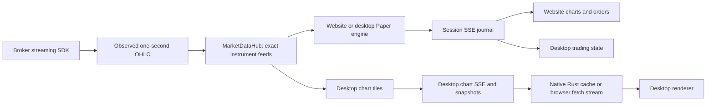

# Phase 19 — Shared live market data and partial take profit

## Agreed implementation scope

Implement shared live streaming for website and desktop; Half / Full for
TargetProfit and UnderlyingTargetProfit; smaller desktop open-order text.
Desktop real trading is deferred. The original requests below are preserved.

## Sprints

1. Document architecture, decisions, acceptance and follow-ups.
2. Shared in-process MarketDataHub, exact-contract subscriptions and Kite lifecycle.
3. Desktop live/Paper integration and common provider fallback.
4. Website live integration, history handoff and SSE recovery.
5. Half / Full strategy sizing, exit allocation, APIs and both clients.
6. Typography, regression verification and Windows acceptance.

Implementation status and verification are recorded at the end of this document.

## Streaming architecture review

Before Phase 19, website Paper/Real selected the admin provider, registered a
provider consumer, and read one-second OHLC from paper_tick_queue. The session
evaluated orders/strategies and published chart and trading events into a
replayable SSE buffer. KiteBroadcaster already shared one KiteTicker across
website sessions; its background thread delivered to asyncio session queues.

Desktop chart streams separately owned tiles, history and queues and hardcoded
Breeze. Native Rust consumed authenticated SSE; the renderer read a local cache
every second and checked backend health every 15 seconds. Browser chart preview
polled snapshots each second. Desktop Paper engines followed website provider
selection, so charts and engines could receive different providers. Phase 18's
prompt trading-event notifications, independent quote batching, event journal,
30-second reconciliation, engine fencing and window ownership must be preserved.

| Approach | Advantages | Costs / limitations | Decision |
| --- | --- | --- | --- |
| Extend KiteBroadcaster directly | Smallest change | Session/provider coupling remains | Migration bridge only |
| Shared service in backend | Shared identity, routing, quotes and lifecycle; low cost | Process-local, API/feed share failure domain | Selected |
| Dedicated feed process | Independent restart and connection ownership | Transport, supervision and recovery; session routing still needed | Future |
| Connection per user/client | Useful for distinct user credentials | Duplicate shared subscriptions, connection limits | Not for shared credentials |

Use one Kite streaming connection per configured credential set, not one per
user or client. Kite supports 3 sockets per API key and 3,000 instruments per
socket (https://kite.trade/docs/connect/v3/websocket/). Multiple sockets each
receive their own subscriptions; they do not partition website/desktop events.
Historical REST clients remain separate. The Python SDK shares a Twisted reactor;
closing a socket must not stop that process-wide reactor.

MarketDataHub owns subscriptions keyed by canonical exchange/kind/symbol or
underlying/expiry/strike/right. A subscription handle releases only its consumer.
Provider adapters own credentials, token resolution and connections. Existing
session and tile adapters preserve downstream event shapes. Trading engines keep
subscriptions independently of chart visibility. Users share quotes, never
wallets, positions or trading events.

Provider selection is captured when a feed group starts. Admin changes affect new
groups; Paper charts inherit their engine's group. Selected and actual providers,
connection state and quote age are visible. Fallback attempts each source once:

| Selected | Paper / desktop charts | Website Real |
| --- | --- | --- |
| Kite | Kite → Breeze | Kite |
| Kotak | Kotak → Kite → Breeze | Kotak → Kite |
| Breeze | Breeze → Kite | Breeze → Kite |
| Fyers | Fyers → Breeze → Kite | Fyers → Breeze → Kite |

The older claim that Real cannot use Breeze is incorrect: current Real supports
Breeze but does not fall back from failed Kite to Breeze. Real execution still
uses Kotak, existing access/authentication checks and broker-confirmed fills.
Transient disconnects reconnect; terminal authentication/retry failures advance
fallback. Keep a successful fallback until explicit restart.

Keep SSE downstream and REST commands. SSE does not distribute in-memory engines,
registries or replay buffers: deployment remains one API worker. Later extraction
needs feed transport plus session ownership and command/event routing, not merely
an extra worker. No Redis, SQS, Kafka or additional database is required now.

Preserve IST-as-UTC chart timestamps and aligned candle boundaries. Kite LTP mode
has no exchange timestamp, so receipt time is explicit. Finalize observed seconds
without waiting for another trade; do not invent empty candles. Order evaluation
remains one-second, rather than raw-tick. Subscribe before loading history; merge
buffered observations into the baseline, keeping minute gap-fill distinct from
real second observations. Refresh and reconnect history are never replayed as
new fills. Provider changes start a fresh aggregation generation.

Use bounded delivery with explicit overflow/gap recovery; preserve candle extrema
and committed trading events. Stream consumption continues during snapshot
recovery. Record connection/subscription counts, source changes, quote age,
overflow and replay gaps through existing logs.

## Half / Full semantics

Persist target_profit_size = full | half, defaulting missing values to full.
Both target variants support editing while armed, before the target condition
fires. Subsequent order changes use ordinary order editing.

Compute Half from the exact-contract current position when the condition fires:
options max(1, floor(current_lots / 2)) lots, equity max(1, floor(shares / 2)),
capped at the position. Lots 1/2/3/4/5 select 1/1/1/2/2. Flat creates no order.
A four-lot position manually reduced to two therefore selects one lot. Target
prices, percentage-of-capital calculations and trigger buffers are unchanged.

Allocate selected quantity from closing orders in creation order, splitting where
necessary and retaining original protection for the remainder. TargetProfit
converts/creates only the selected quantity as LIMIT; UnderlyingTargetProfit
shifts/creates only that quantity using its existing option-price buffer. Reconcile
remaining exits after fills/manual reductions. Real modifications are confirmed
before local updates; failed actions stay retryable without duplicating successes.

Website forms and both context menus expose Half / Full; armed strategies can
change size separately from price; labels show size. Desktop open-order summary
text becomes .625rem; ticket inputs and controls retain their sizes.

## Acceptance and deferred work

Automated coverage: shared connection and instrument subscription across users,
exact strikes/expiries, independent release, concurrent startup/reconnect,
credential replacement, quiet symbols, queue overflow, history handoff, SSE gaps,
source selection/fallback, half rounding/manual exits, remaining protection,
long/short contracts, failures and legacy Full compatibility.

Windows acceptance: rebuilt native app, live Kite, website plus desktop and two
users/screens, equity/NIFTY/CE/PE, refresh and interval switches, pop-out, reconnect,
provider failure, partial take profit with existing stops, Paper Stop/Resume and
wallet recovery. Do not label mocked broker tests as live acceptance.

### Authentication follow-up (same document, separate implementation)

Legacy website REST trusts X-User-Id; SSE now checks the supplied user identity
against session ownership, but that supplied identity is not verified authentication.
Desktop has verified bearer tokens but retains a trusted-header compatibility
path. Ownership comparisons alone do not verify identity.

Migrating now gives verified isolation immediately but broadens this phase into
login, REST and SSE compatibility work. A separate follow-up keeps the feed and
strategy changes independently reviewable, but the deployment limitation remains
until migration. The separate follow-up is selected.

Reuse the token lifecycle behind client-neutral endpoints, migrate website
password/Google login and REST/fetch-SSE to verified tokens, handle expiry,
refresh/logout/reconnect, and remove production trusted-header fallback. Explicit
development/test identities stay non-production. Test forged headers, cross-user
sessions, expiry and logout. No new roles or trading restrictions are needed.

## Implementation and verification status

All six sprints are implemented on `dev`; native Windows interactive and live
market acceptance are tracked separately from code completion.
The shared hub routes website and desktop subscriptions through existing provider
SDK adapters; no desktop real-trading workflow has been added. Exact-contract
quotes, history watermarks, generation checks, provider status and SSE reset
recovery are integrated. Both clients expose Half / Full and armed size edits.
Split orders retain the remaining protection, and tagged pending exits are capped
or cancelled after committed position reductions. Broker changes precede local
updates; paper execution also caps tagged orders against the remaining position.

Automated verification uses mocked provider connections and isolated DynamoDB
fixtures. Website and desktop production builds pass. The focused backend suite,
Paper wallet/recovery/EOD suite, desktop renderer suite and native Rust tests pass;
final counts and commands are recorded below. Native Rust checks ran on Linux,
which verifies the host code but is not a Windows installer or interactive test.
The drawing-persistence regression found during verification is fixed: validation
accepts numeric DynamoDB `Decimal` prices when updating a saved drawing.

A separate legacy API test run timed out on the first synchronous `TestClient`
request, waiting inside the AnyIO thread portal in this execution environment.
That limitation is not counted as a pass; the entire backend suite is not claimed
as passing. Existing direct router/service tests cover the affected flows, and
market-hours/manual acceptance remains outstanding.

Valid broker tokens are useful for the market-hours acceptance run; automated
checks do not depend on those tokens and do not place live orders.

### Sparse diagnostic logs

Normal ticks, quotes, timer flushes, candle updates and renderer polling do not
produce new INFO logs. Use backend logs to trace these lifecycle boundaries:

- `market_data_feed_opened` / `market_data_subscribed`: provider, canonical
  instrument, consumer and active upstream count. Duplicate consumer subscriptions
  share a feed; different instruments still have separate upstream registrations
  on the same SDK connection.
- `market_data_first_tick`: once per upstream lifetime; confirms the broker data
  reached the hub. It is expected to be absent when exchanges are closed.
- `market_data_feed_released`: emitted when the last consumer releases a feed.
- `market_data_subscribe_failed`, `market_data_handover`,
  `market_data_connection_restored`: startup failure, fallback generation and
  socket recovery. Kite/Fyers socket health is checked separately from quote
  activity, so reconnecting at night does not require a fresh tick.
- `market_data_overflow`: first queue loss and at most once per minute per
  consumer thereafter. Replay gaps are logged when an SSE reset is required.
- `take_profit_half_allocated`, `take_profit_half_completed`,
  `take_profit_half_deferred`, `take_profit_exit_reconciled`: chosen lot quantity,
  committed actions, retryable failures and changes to remaining exits. Repeated
  half-action failures are logged at most once per minute per strategy.

At night, validate builds, mocked delivery, startup/cleanup and socket status.
Do not use quote silence as proof of a streaming defect. During market hours,
open the same contract in website and desktop, check one feed-open log with
multiple consumers, one first-tick log, and matching chart prices. Closing one
client must leave the other consumer receiving data; closing the last consumer
must produce the feed-release log. Compare chart history after reconnect and
exercise Half against four lots, then a manually reduced position, in Paper.

## Delivered implementation details

### Components and ownership

| Component | Responsibility |
| --- | --- |
| `services/market_data.py::MarketDataHub` | Normalize exact instruments; deduplicate provider registrations; distribute observations; cache quotes; manage feed-group fallback |
| `FeedGroup` | Capture selected/actual provider, connection state and generation for an engine and its attached charts |
| `Subscription` | Release one consumer independently; closing a window cannot release another user's feed |
| `ProviderAdapter` | Resolve provider-specific tokens/symbols and register with existing Kite, Fyers, Kotak or Breeze SDK adapters |
| `SessionFeed` | Own underlying and base CE/PE engine subscriptions; replace a chart strike without interrupting unrelated subscriptions |
| `desktop_live_service` | Own chart tiles, history, observation caches, chart SSE and snapshot recovery |
| `simulation` | Apply history/live watermarks; evaluate orders and strategies; publish session trading events |
| `strategy_service` / `order_service` | Allocate Half; preserve remaining protection; persist sizing; reconcile tagged exits after position changes |



SDK callbacks cross into the asyncio loop using the existing thread-safe
broadcaster bridge. Historical REST work runs off the event loop. The hub owns a
provider/instrument registration, while SDK broadcasters own the shared socket;
one registration per instrument does not mean one socket per instrument.

Desktop browser preview now consumes authenticated fetch SSE rather than
requesting snapshots every second. Native desktop retains Rust SSE consumption,
local cache reads and prompt trading notifications from Phase 18. Periodic
snapshots reconcile history and state independently of quote delivery. Website
EventSource retains cursor replay, and an expired cursor requests reconciliation
through `stream_reset`.

### Recovery and lifecycle behavior

Subscriptions begin before history loads. Historical observations populate
charts and exact-contract watermarks; they do not run Paper/Real fills. Live
observations at or behind a contract's watermark are discarded. Provider and
feed-generation checks run before advancing live watermarks, so obsolete queued
observations cannot suppress the replacement provider's valid data.

Fallback prepares replacement registrations before moving consumers. Failed or
cancelled preparation releases replacements. A consumer closed during preparation
stays closed. Releasing a group's last consumer cancels its pending recovery.
Each SDK delivery bridge belongs to one upstream registration: callbacks from a
released socket/registration cannot write into a newly opened feed with the same
instrument key.

Connection recovery, fallback and exhaustion publish `feed_status` even without
a quote. Desktop ignores older status cursors. Kite's elapsed-second timer emits
an observed candle once and keeps a finalized watermark so late packets cannot
emit it again. No timer creates artificial candles when a market is closed.

Queue overflow reports an explicit gap and prompts snapshot reconciliation.
Dropped observations are not replayed as hypothetical fills. A successful
fallback remains selected for that group's lifetime; an admin source change
applies to new groups. The deployment still uses one API worker.

### Strategy API, persistence and client behavior

`POST /api/strategies/start` accepts `target_profit_size: "full" | "half"`.
Omitted fields and old saved strategies default to Full. The desktop start route
uses the same strategy implementation. Size edits use:

- Website: `PATCH /api/strategies/{strategy_id}/size`.
- Desktop: `PATCH /api/desktop/v1/trading/{session_id}/strategies/{strategy_id}/size`.
- Body: `{ "session_id": "…", "target_profit_size": "half" }`.

An armed strategy can change size before its condition fires. Once it has applied
an action, its generated orders use ordinary order editing; changing size does
not re-run a completed strategy. Both TargetProfit and UnderlyingTargetProfit
have Half/Full context menus, form controls, editable armed sizing and size labels.

Half reads the current exact-contract position at the condition, rounds down to
whole option lots and selects at least one lot when a non-flat position exists.
An oversized old closing order is trimmed to the current position before the
selected quantity is split. Existing closing orders are allocated in creation
order. The remainder keeps its original trigger/limit price. Successful action
IDs are retained for retry, and completion is persisted only after actions
succeed. Half-action and size-edit persistence errors propagate rather than
silently reporting success. Broker modifications are acknowledged before local
quantity/type changes.

Orders persist `exit_allocation_id` and `exit_position_side`. After a committed
trade, pending allocated exits shrink or cancel to match the remaining position;
Paper execution also caps their quantity before filling. `order_updated` events
carry changed orders to both clients. The desktop reducer merges an existing
order instead of duplicating it or ignoring its new quantity. `strategy_updated`
refreshes armed strategy state. These additions do not enable desktop real trading.

### Lessons learned

1. Share market-data ownership at the instrument boundary, while keeping trading
   state and downstream journals scoped to each session/user. Sharing the SDK
   socket alone did not align desktop charts with their engines.
2. A healthy connection and fresh quotes answer different questions. Night-time
   quote silence must not trigger fallback by itself; status changes also need a
   delivery path independent of incoming quotes.
3. Subscribe before loading history, then use exact-contract watermarks. A
   historical baseline must not execute restored orders, and stale generations
   must be rejected before they update those watermarks.
4. Cancellation is part of subscription ownership. An SDK startup thread can
   finish after cancellation, and a fallback can finish after a window closes;
   both need explicit cleanup. Registration-specific delivery identity prevents
   late callbacks reaching a new owner.
5. Partial exits require both allocation and reconciliation. Half rounding alone
   is insufficient when an old stop still covers the larger position or the user
   reduces the position after allocation.
6. Local persistence and broker acknowledgement are separate success boundaries.
   Retain successful action IDs for in-process retries, propagate failed writes,
   and do not change local protection after a rejected broker resize. This does
   not claim distributed exactly-once execution across a broker/process crash.
7. Incremental UI events must support mutations to existing orders. Testing only
   placement and fills misses the visible quantity changes caused by splitting.
8. Keep diagnostics at ownership/state transitions. First observation, fallback,
   release and throttled gaps give useful evidence without one log per tick.
9. Mocked streaming and Rust unit tests can verify architecture while exchanges
   are closed; they cannot establish live broker behavior or Windows interaction.
   DynamoDB fixtures that already use Moto must run without a nested shared Moto
   context, otherwise independent tests can accidentally share wallet records.

### Verification and remaining acceptance

Final verification on 2026-10-01:

| Check | Result |
| --- | --- |
| Focused backend regression suite | 377 passed |
| Paper wallet / recovery / EOD suite with independent fixtures | 21 passed |
| Phase 19 tests (included in the focused suite) | 45 passed |
| Desktop renderer suite | 105 passed across 19 files |
| Native Rust host tests on Linux | 16 passed |
| Website TypeScript and Vite production build | Passed |
| Desktop TypeScript and Vite production build | Passed |
| Python compilation and `git diff --check` | Passed |
| Full legacy API suite via synchronous TestClient | Environment timeout; not claimed passing |
| Windows interactive and live broker acceptance | Pending external acceptance |

The automated checks cover shared users/tiles, exact option identity, independent
release, initial fallback, group handover, stale SDK callbacks, close-during-
handover cleanup, recovery cancellation, quiet-second finalization, night-time
socket recovery, history without broker orders, Half lot rounding, long/short
splits, manual reductions, preserved stop prices, broker failure and persistence
retry. Existing simulation, order, strategy, wallet and recovery tests remain in
the regression run. Desktop tests cover order mutations and stale status cursors.

Commands used from the project directories:

```bash
# Website
cd frontend
node node_modules/typescript/bin/tsc --noEmit
node node_modules/vite/bin/vite.js build

# Desktop renderer
cd windowsapp
npm run build
npm test

# Native host (Linux environment, cached dependencies)
cargo test --offline --manifest-path windowsapp/src-tauri/Cargo.toml

# Backend suites that own their DynamoDB fixtures
cd backend
/home/pratt/venvs/tradematangi/bin/python -m pytest \
  tests/test_phase18_paper_wallet.py tests/test_desktop_paper_recovery.py \
  tests/test_desktop_paper_eod.py -q
```

The focused backend run wraps tests without their own Moto fixtures in
`mock_aws()` and sets `app.services.db.USE_DYNAMODB_LOCAL = False`, avoiding
contact with local/live DynamoDB. It includes Phase 19, trading, strategies,
simulation, Phase 4 order updates, Paper option contracts, orders, desktop
trading/replay events/persistence/live refresh and Kite tests. Builds report
existing bundle-size warnings; compilation succeeds.

Interactive acceptance still requires the Windows app and live market data:
website plus desktop on the same contract, two user sessions, refresh/interval
changes/pop-out, reconnect/fallback, and Paper Half with existing stops and manual
reductions. No real orders were placed during implementation. Authentication
migration and distributed feed/session ownership remain the explicitly deferred
follow-ups above; neither is required to deploy the current single-worker design.

## Review follow-up implementation — 2026-10-01

The unstaged-change review found eight gaps in failure recovery and concurrency.
The three follow-up sprints below are implemented on `dev`. They retain the
process-local hub and existing order/strategy persistence boundaries; desktop
real trading remains outside Phase 19.

### Sprint A — Partial-exit recovery and independent reconciliation

Before changing protection, Half persists its selected quantity and a prepared
chunk in strategy metadata. `half_selected_quantity` freezes the first allocation
and is capped by a later reduced position. Adding to a position during retry does
not increase that allocation. Each prepared chunk records its action ID, selected
quantity, and (for a split) the remainder ID and original quantity. Stable action
IDs derive from the strategy and original order, with a separate ID for an
unprotected portion. The internal order service accepts these IDs; existing
public order request models are unchanged.

Orders carry allocation ID, original position side, and an optional `action` or
`remainder` role. New actions receive these fields in their first strict write.
Older records remain readable because these fields are optional. Strategy
progress records committed action IDs. On retry, the prepared record and existing
order are reconciled before another allocation is attempted. A failed prepare
write makes no order changes. A failed resize/action write cancels an
uncommitted action and persists its cancellation before restoring the original
protection. An action with an acknowledged broker ID remains tracked rather
than being treated as a rolled-back local operation.

After a committed position change, reconciliation caps aggregate tagged exits
for the exact symbol/right/strike/expiry and position side. Broker acknowledgement
precedes local resize or cancellation. A storage failure after an acknowledged
cancellation is repaired even though the order has left the pending list.
Failures enter a contract-scoped retry queue. The application lifespan owns its
worker: first retry after 5 seconds, then 10, 20, and 30 seconds, capped at 30.
The worker does not need another trade or market tick. Contract-scoped locks
serialize trade-triggered and worker reconciliation, and an older worker result
cannot clear a newer failed reconciliation request. Paper order restoration
reconstructs reconciliation work from persisted allocation tags and current
positions. The retry schedule is transient; persisted orders are its restart
source. Repeated failure logs are limited to once per minute per contract.

This is recoverable local intent, not an atomic transaction with the broker.
An ambiguous network timeout around broker order placement still needs the
broker's order reconciliation behavior; stable local IDs alone cannot prove
exactly-once broker execution. No real broker orders were sent in verification.

### Sprint B — Provider and tile lifecycle

An engine's initial underlying/option subscriptions now form one candidate
bundle. A provider is committed only when the complete bundle opens. Failure
releases that candidate's handles and tries the next permitted provider. Private
candidate queues prevent a failed provider's early ticks from entering the
engine. Rebind candidates use the same isolation until handover commits.
Existing consumers retain their shared feed ownership and independent handles.

Opening another tile on a group that is reconnecting no longer changes the
group to connected. Recovery comes from socket health or a provider observation.
A quiet exchange therefore remains distinct from a disconnected socket.

Chart history survives a provider change for display, but `option_quote` reads
only the current subscription's hub quote. Handover/disconnection establishes a
quote provenance boundary, so an earlier quote cannot authorize a chart-originated
Paper market order. There is no arbitrary quote-age timeout; a new observation
from the current feed restores eligibility.

Tile startup now checks tile object identity, history generation, and stream
lifecycle after the awaited subscription. A removed or replaced tile closes its
late handle instead of committing it. A per-tile activation lock also prevents
concurrent refresh/startup calls from creating duplicate handles.

### Sprint C — SSE and desktop snapshot reconciliation

Website SSE captures the replay-reset cursor once and reuses it after yielding.
An event arriving while the generator is suspended is therefore delivered after
the reset rather than skipped.

The desktop renderer uses one bounded live event journal for browser SSE and
native event batches. HTTP snapshot recovery keeps the returned historical
baseline and replays newer candle/status observations received in flight. It
also preserves newer observations already represented in renderer state if a
bounded journal has evicted older events. Matching uses stream identity and
contract identity for retained tile observations. Delayed responses/events from
an old stream cannot replace the active stream. Explicit stream starts and
restoration can replace it. Browser reconnect recovery, periodic health checks,
manual refresh, and native health checks share this reconciliation path.

Regression coverage includes failed remainder and action persistence, persisted
prepare recovery, frozen quantities after position growth, independent timed
retries, acknowledged-cancellation write repair, option-only startup failure,
failed-candidate tick isolation, reconnect status preservation, tile removal
during startup, current-provider quote eligibility, the SSE reset-yield race,
and snapshot requests with intervening events/native batches.

### Lessons from the review

- A broker resize, local order write, and strategy progress write are separate
  failure points. Save intent before mutation and recover from both order and
  strategy records; an in-memory list of action IDs is insufficient.
- Rollback ordering matters: restoring a full stop while a new action remains
  pending can over-protect a position. Confirm the uncommitted action is removed
  before restoring quantity. Known broker actions need reconciliation instead.
- Retry responsibilities belong to lifecycle workers. Market ticks are not a
  reliable retry clock, especially after market close or a manually flattened
  position.
- Subscription startup succeeds as a bundle for engines. Candidate observations
  must stay isolated until that provider is selected.
- A subscription registration is not evidence that a disconnected socket has
  recovered. Display history is also not execution quote provenance.
- Check resource ownership after every awaited acquisition. Removal during
  startup is a normal lifecycle race, and concurrent startup needs serialization.
- A newer event cursor and an authoritative history baseline contain different
  information. Keeping only one loses either history or recent observations;
  reconcile both, including browser polling and native recovery paths.

Automated acceptance remains exchange-independent. Windows interaction and live
market/broker behavior still require the external acceptance checks above.

## Website P&L indicator rendering follow-up — 2026-10-01

The website's P&L level calculator and pane position/capital wiring were reviewed.
The previous renderer used React DOM overlays with geometry calculated from
chart coordinates in effects. It removed every level if the aligned fill time
was absent from the chart time scale. Its updates also depended on React inputs,
time-range notifications, and selected DOM events rather than the chart's price
scale repaint. These paths can miss asynchronous history loads and price-scale
changes when the trade anchor is already known.

Lightweight Charts 4.2 supports this drawing through its native series primitives
API. `PositionPnlPrimitive` now attaches to the candlestick series and draws the
existing five-bar segments and labels directly on the chart canvas. Coordinates
are calculated during drawing, after chart autoscaling; no extra price-scale
events or DOM overlay state are needed. If a fill timestamp is missing, the
nearest available candle anchors the segment until its actual candle arrives.
No-trade fallback anchors remain stable while new candles arrive. The renderer
uses the chart pane's actual media bounds rather than the container dimensions,
so lines do not extend into the price/time axes. It detaches during chart cleanup.

The financial calculation, target percentages, indicator toggle, and exact
position filtering are unchanged. An open position with valid session capital is
required. Off-screen price levels remain off-screen; the indicator does not
stretch autoscale to include distant percentage targets.

Eight regression tests exercise exact-price segments/labels, absent fill times,
deferred history loads, price-scale redraws without a changed time range, stable
fallback anchors, pane clipping, disable/detach cleanup, and repaint requests.
They run alongside the existing financial-level tests in the renderer test
harness. Verification: 113 renderer tests pass, website and desktop TypeScript
checks and production builds pass, and `git diff --check` passes. Canvas tests
use controlled chart transforms; interactive browser acceptance is still needed
to confirm the reported screen/session visually.

Lesson: chart-bound drawings should use the library's render lifecycle. React
state changes alone do not describe every time/price transform change, and a
missing chart timestamp should not erase otherwise valid price levels.

## Original requirements

# Improvements

## Integration Desktop Client With Real Trading
Integrate Desktop Client to support Real Trading.
Keep an option in Paper trading live to switch between paper and real (toggle switch). The real trading option would come only if admin has allowed that user for real trading.

Include all the features that is available in Paper Trading. Also, look through website, for specific real trading flows like target orders, limit orders, take profit strategy or underlying target strategy, stoploss orders.

## Supporting Kite Streaming In Desktop Client
Support Kite Streaming data is Desktop Client. If Kite is selected in the settings in admin to be streaming data source, then use Kite for streaming symbols. However, if possible maintain a single Kite Client for both website and desktop, I mean the actual kite client (external library), you are free to abstract it and use separate classes for Desktop and Website. I am suggesting only single kite client as Kite supports multiple symbols being asked to stream, not sure what would happen if we have 2 kite cclients on same process in python backend, how would SSE events From Kite Zerodha work (Kite server to our backend).

Do discuss this approach.


## Enhanced Take Profit Strategy
Introduce in take profit strategy an option to apply the strategy on half of the open position. The strategy should only apply the change
or the take action on half of the position. For calculating half, maximum it to 50%, when considering lot sizes for options. However, if one 1 lot is in position, then apply the strategy on that 1 lot, it should be applied to atleast 1 lot and maximum upto 50%.

In the website, the take profit strategy UI include an option to select half. In right click UI for website and desktop, when take profit strategy is selected give a sub menu of half or full. After a strategy is already triggered I can have an option to edit the strategy to select half size.

It may happen that when take profit strategy (half) was triggered we had 4 lots and by the time it reaches the pricce, user had already exited 2 lots. In that case, exit only 1 lot, i.ee half of the current position size.


## Desktop Client Open Orders
1) Reduce the open orders text size in desktop client. It just for notification.

